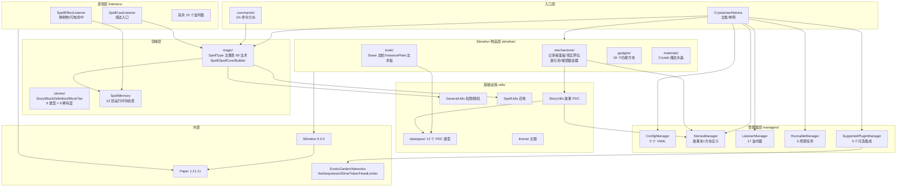
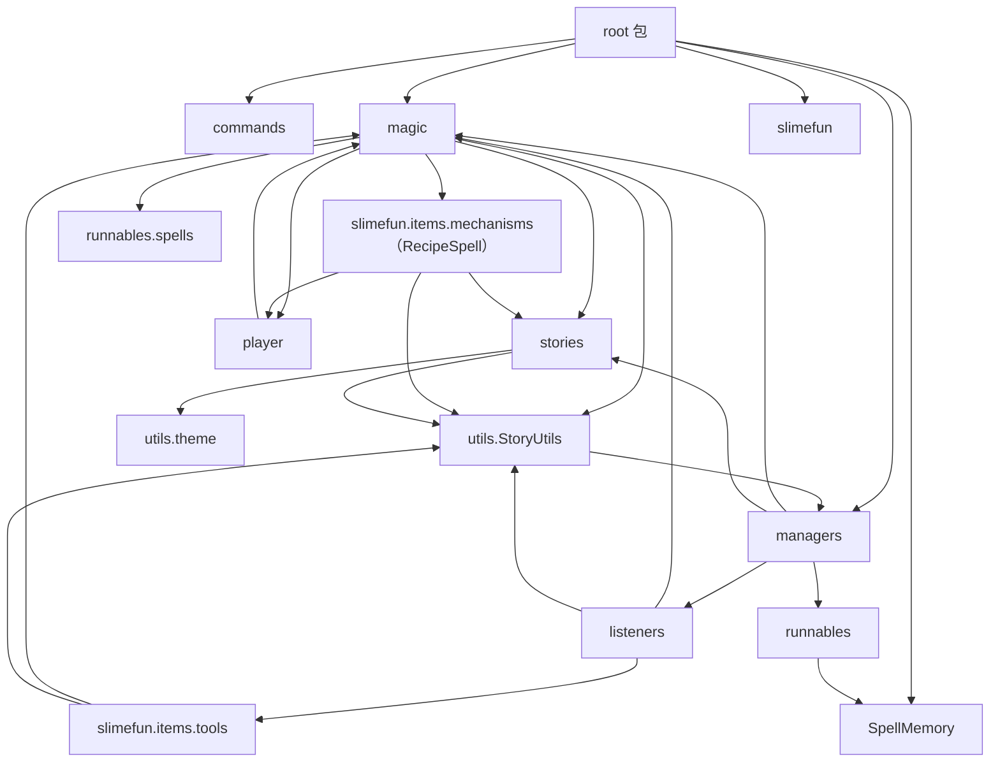
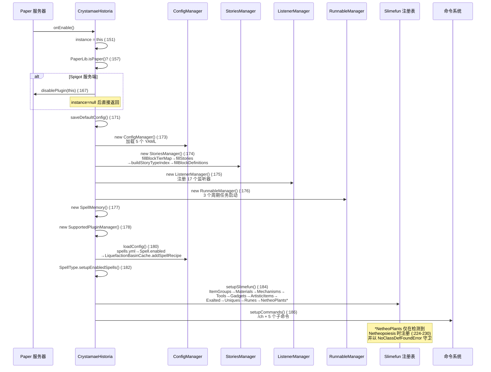
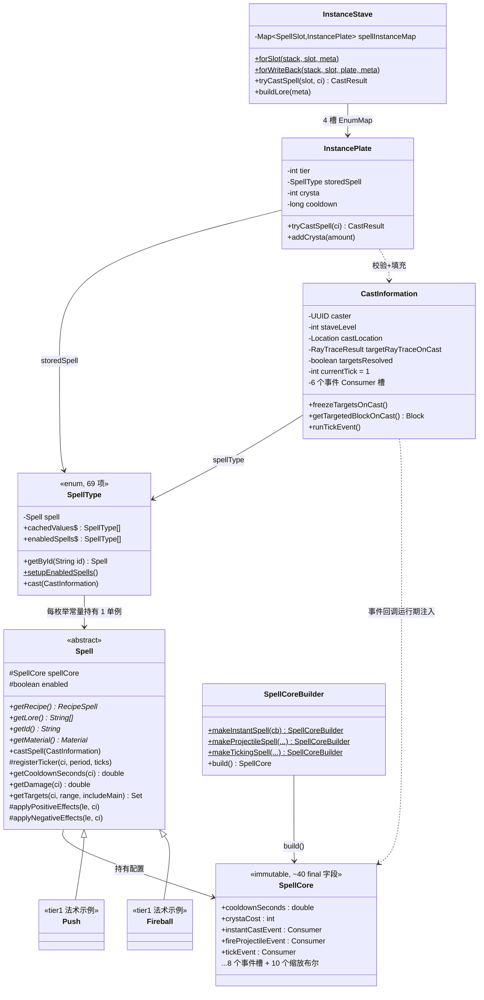

# CrystamaeHistoria 项目架构分析报告

> 分析时间：2026-08-16 13:19
> 分析范围：`f:\Github\repo\CrystamaeHistoria-1.21.11`（完整分析模式，264 个 Java 文件 / ~33,605 行）
> 所有论断均附源码文件路径与行号证据。

---

## 1. 项目快照

| 字段 | 值 |
|------|-----|
| **项目名称** | CrystamaeHistoria（魔法水晶编年史）`pom.xml:7-8` |
| **版本** | 0.2.0（版本序列自 0.1.0 起算，`note/README.md`） |
| **技术栈** | Java 21（`pom.xml:11`）、Maven（shade 3.4.1，`pom.xml:31`）、Paper API 1.21.11（`pom.xml:79-83`）、Slimefun 5.0.0（`pom.xml:85-90`） |
| **代码规模** | 264 个 Java 文件，~33,605 行 |
| **语言分布** | 单语言 Java；资源文件 7 个 YAML + 14 个 JSON 标签（`src/main/resources/`） |
| **构建工具** | Maven（`clean package` 默认目标，`pom.xml:61`） |
| **CI/CD** | GitHub Actions（`.github/workflows/maven.yml`） |
| **分支策略** | 单主干 master（`git branch` 实测） |
| **贡献者** | 16 人（Sefiraat 420、ybw0014 117、Zurker 115 次提交居前） |
| **分析模式** | 完整分析（264 文件 ∈ 50–500 区间） |

### 1.1 依赖全景（`pom.xml:76-141`）

| 依赖 | 版本 | Scope | 用途 |
|------|------|-------|------|
| `io.papermc.paper:paper-api` | 1.21.11-R0.1-SNAPSHOT | provided | 服务端 API（强制 Paper，`CrystamaeHistoria.java:157-169` 拒绝 Spigot） |
| `com.github.slimefun:Slimefun` | 5.0.0 | provided | 宿主插件 API（本地仓库安装自 `lib/Slimefun-5.0.0.jar`，CI 步骤 `maven.yml` "Install vendored Slimefun 5.0.0"） |
| ExoticGarden / Networks / Netheopoiesis | jitpack 快照 | provided | 可选附属集成（运行时守卫，`SupportedPluginManager.java:20-31`） |
| Lombok | 1.18.34 | provided | `@Getter/@Setter` 样板消除 |
| spotbugs/jsr305 + jetbrains annotations | — | provided | 空值契约注解（`@Nonnull/@Nullable`） |

**零运行时第三方依赖**：shade 插件仅做资源过滤打包（`pom.xml:33-49`），产物无任何 shaded 库——InfinityLib/EffectLib/GuizhanLib 等已在迁移时以"等价本地移植"方式内联（`TickingMenuBlock.java:16-23`、`HistoriaCommand.java:21-25` 注释）。

---

## 2. 目录结构全景与功能角色

```text
src/main/java/io/github/sefiraat/crystamaehistoria/
├── CrystamaeHistoria.java          [入口层] JavaPlugin + SlimefunAddon 主类（244 行）
├── SpellMemory.java                [状态层] 13 张法术运行时状态映射表（348 行）
├── commands/           (7 文件)    [入口层] /ch 命令分派器 + 5 个子命令
├── listeners/          (17 文件)   [表现层] Bukkit 事件监听（施法/法术效果/物品保护）
├── magic/              (82 文件)   [业务层] 法术领域模型
│   ├── CastInformation.java        单次施法运行时上下文（懒 raycast 冻结）
│   ├── CastResult.java             施法结果枚举（5 态）
│   ├── SpellType.java              法术枚举注册表（69 项，197 行）
│   ├── DisplayItem.java            悬浮展示物品
│   ├── spells/core/   (5 文件)     Spell 抽象基类/SpellCore/Builder/InstanceStave/InstancePlate
│   ├── spells/spellobjects/ (3)    MagicProjectile/MagicFallingBlock/MagicSummon 句柄
│   └── spells/tier1/  (69 文件)    69 个具体法术实现
├── managers/           (5 文件)    [业务层] Config/Stories/Listener/Runnable/SupportedPlugin 管理器
├── player/             (5 文件)    [数据层] PlayerStatistics + 4 种Rank（player_stats.yml 持久化）
├── runnables/          (6 文件)    [调度层] 3 个周期任务 + spells/ 3 个法术动画任务
├── slimefun/           (92 文件)   [外部接口层] Slimefun 物品注册
│   ├── ItemGroups.java             13 个物品组（ItemGroups.java:24-122）
│   ├── Materials/Mechanisms/Tools/Gadgets/...  9 个注册入口类（setup() 静态注册）
│   ├── items/mechanisms/           5 类机械（chroniclerpanel/realisationaltar/liquefactionbasin/prismaticgilder/staveconfigurator）
│   ├── items/gadgets/   (18 文件)  功能方块（灯/风扇/烫板/陷阱等 7 类 tick 模式）
│   ├── items/tools/                工具（stave 法杖/plates 法术板/satchel 背包/covers）
│   ├── items/materials/            Crystal 魔法水晶等材料
│   └── machines/                   MenuBlock/TickingMenuBlock 基类（InfinityLib 等价移植）
├── stories/            (9 文件)    [领域层] Story/BlockDefinition/BlockTier + definition/ 5 个枚举定义
└── utils/              (39 文件)   [基础设施层] StoryUtils/GeneralUtils/SpellUtils + datatypes/(12 个 PDC 类型) + mobgoals/(12 个 AI 目标) + theme/
```

### 2.1 目录角色标注

| 目录 | 架构角色 | 证据 |
|------|---------|------|
| `CrystamaeHistoria.java` | **入口层**：单例 + 生命周期编排 | `CrystamaeHistoria.java:47-61`（instance 单例）、`:149-187`（onEnable） |
| `commands/` | **入口层**：CLI 式子命令分派 | `HistoriaCommand.java:27-57`（TabExecutor + LinkedHashMap 分派） |
| `listeners/` | **表现层**：事件→业务转译 | `ListenerManager.java:25-43` 集中注册 17 个监听器 |
| `magic/` | **业务逻辑层**：法术领域 | `Spell.java:38`（抽象基类）、`SpellType.java:80`（注册表） |
| `stories/` | **领域层**：故事实体与概率规则 | `BlockTier.java:7-29`、`StoryChances.java`（和必须为 100 的构造校验） |
| `player/` | **数据访问层**：YAML 直写统计 | `PlayerStatistics.java:19-32`（path 拼接 → `player_stats.yml`） |
| `slimefun/` | **外部接口层**：向 Slimefun 注册物品/机械 | `CrystamaeHistoria.java:214-231`（setupSlimefun 顺序调用 9 个 setup） |
| `utils/` | **基础设施层**：PDC 序列化/权限/粒子/主题 | `utils/datatypes/` 12 个 PersistentDataType 实现 |

---

## 3. 系统分层架构图



**分层判定依据**：依赖方向严格自上而下（入口→管理器→领域→基础设施），未发现领域层反向引用入口层的回环；`magic/` 包仅 import `managers/`（读配置）、`utils/` 与 `runnables/spells/`（`Spell.java:3-35` import 列表），不 import `slimefun/items` 具体物品（仅 `liquefactionbasin.RecipeSpell` 一个例外，`Spell.java:6`）。

---

## 4. 模块依赖关系图（包级）



**关键依赖观察**：

1. `magic ↔ slimefun.items.tools.stave` 存在**双向依赖**：`SpellCastListener.java:6-7` import `SpellSlot/Stave`，而 `InstanceStave.java:6` 反向引用 `SpellSlot`——这是有意的事件层缝合点，通过 `InstanceStave`（magic 包）持有 `SpellSlot`（slimefun 包）实现解耦分发（`InstanceStave.java:31`）。
2. `utils.StoryUtils` 反向依赖 `managers.StoriesManager`（`StoryUtils.java:7`）——工具类承担了领域查询职责，是唯一"基础设施→业务"的反向边。
3. `player.PlayerStatistics` 依赖 `magic.SpellType` 与 `stories.BlockDefinition`（`PlayerStatistics.java:4-6`），以字符串 path 直写 YAML（`PlayerStatistics.java:26-27`），无 ORM。

---

## 5. 核心模块深度分析

### 5.1 入口与初始化链路

**主类 `CrystamaeHistoria extends JavaPlugin implements SlimefunAddon`**（`CrystamaeHistoria.java:47`）

启动序列（`onEnable`，`CrystamaeHistoria.java:149-187`）：



**关闭序列**（`onDisable`，`CrystamaeHistoria.java:201-212`）：遍历所有 `ChroniclerPanelCache.shutdown()`（清理展示架动画）→ `spellMemory.clearAll()`（13 张表全量清理，`SpellMemory.java:55-110`）→ `configManager.saveAll()`（config.yml + player_stats.yml 落盘，`ConfigManager.java:106-124`）→ `instance = null`。

### 5.2 魔法系统（magic/）——四件套抽象

| 抽象 | 文件:行 | 角色 |
|------|---------|------|
| `SpellType`（enum） | `SpellType.java:80-151` | **注册表**：69 个枚举常量各持一个 `Spell` 单例，类加载时实例化；`cachedValues`（`:154`）与 `enabledSpells`（`:156`）缓存数组避免每次 `values()` 复制 |
| `Spell`（abstract） | `Spell.java:38` | **模板基类**：抽象方法 `getRecipe()/getLore()/getId()/getMaterial()`（`:48,73,76,84`）；入口 `castSpell()`（`:87`）按 SpellCore 类型分派 |
| `SpellCore` | `SpellCore.java:13-54` | **不可变配置**：约 40 个 final 字段（数值 + 10 个 stave 级缩放布尔 + 8 个 `Consumer<CastInformation>` 事件槽） |
| `SpellCoreBuilder` | `SpellCoreBuilder.java:16-74` | **流式构建器**：`makeInstantSpell/makeProjectileSpell/makeTickingSpell/makeDamagingSpell/makeHealingSpell/makeEffectingSpell`（`:78-113+`）链式叠加能力 |

**法术系统类图**：



**69 个法术的统一实现范式**（以 `Push.java:18-40` 与 `Fireball.java:19-47` 为证）：

```text
public class X extends Spell {
    public X() {
        setSpellCore(new SpellCoreBuilder(冷却, 冷却分摊?, 射程, 射程乘算?, 晶能, 晶能乘算?)
            .makeDamagingSpell(...)     // 可选能力叠加
            .makeProjectileSpell(...)
            .makeTickingSpell(this::onTick, ...)
            .addAfterTicksEvent(this::afterAllTicks)
            .build());
    }
    // 事件回调方法（Consumer<CastInformation>）
    @Override getRecipe() → new RecipeSpell(tier, 3 个 StoryType)   // 如 Push.java:51-58
    @Override getName()/getLore()/getId()/getMaterial()             // 展示与注册元数据
}
```

### 5.3 Slimefun 物品层

**注册顺序**（`CrystamaeHistoria.java:214-231`）：`ItemGroups.setup()`（13 组，`ItemGroups.java:24-122`）先行，随后 `Materials/Mechanisms/Tools/Gadgets/ArtisticItems/Exalted/Uniques/Runes` 各自静态注册，`NetheoPlants` 条件注册。

**机械体系**（均基于本地移植的 `TickingMenuBlock`，`TickingMenuBlock.java:24-53`，构造时挂旧版 `BlockTicker` 每 Slimefun tick 回调 `tick(Block, BlockMenu)`）：

| 机械 | 类 | 层级 | 职责 |
|------|-----|------|------|
| 记录者面板 | `ChroniclerPanel.java:23` | T1–T5（`Mechanisms.java:63-119`） | 从物品发掘故事 |
| 现实祭坛 | `RealisationAltar.java` | T1–T5（`Mechanisms.java:132-188`） | 从满故事物品提取魔法水晶 |
| 液化池 | `LiquefactionBasin.java` | 按容量分级 | 水晶→液化魔法→配方匹配产法术板 |
| 棱镜镀金器 | `PrismaticGilder.java` | — | 故事镀金 |
| 法杖配置器 | `StaveConfigurator.java` | — | 法术板装配进法杖 |

**每机械一份 Cache**（`ChroniclerPanelCache.java:38`、`RealisationAltarCache.java:47`、`LiquefactionBasinCache.java:54`），以 `Map<Location, Cache>` 静态表跟踪运行实例（`ChroniclerPanel.java:32` `CACHES`）。

**Gadget 层 7 类 tick 模式**（`gadgets/` 18 文件；`MobCandle.java:35-60` 为代表）：`onFirstTick`（从 BlockStorage 恢复状态）+ `onTick`（每 tick 周期效果，含 `expiryMap` 过期管理，`MobCandle.java:45-46`）。

### 5.4 数据序列化层（utils/datatypes/）

12 个自定义 `PersistentDataType`（`utils/datatypes/` 目录）将领域对象写入物品 PDC：

| 类型 | 持久化对象 | 使用方 |
|------|-----------|--------|
| `PersistentStaveDataType` | `Map<SpellSlot, InstancePlate>` | 法杖（`InstanceStave.java:47-51`） |
| `PersistentPlateDataType` | `InstancePlate` | 法术板（`LiquefactionBasinCache.java:263-267`） |
| `PersistentStoriesDataType` | `List<Story>` | 故事物品（`StoryUtils.java:313`） |
| `PersistentSatchelInstanceType` | `SatchelInstance` | 晶能背包（`LiquefactionBasinCache.java:335-353`） |
| `PersistentStoryChunkDataType` | 区块故事状态 | 现实祭坛（`RealisationAltarCache.java:16`） |
| `PersistentUUIDDataType` / `LocationDataType` / `BooleanDataType` / `DoubleArrayDataType` / `PersistentPoseType` | 基础类型封装 | 各处 |

`DataTypeMethods.getCustom/setCustom`（`utils/datatypes/DataTypeMethods.java`）是统一读写入口，配合 `Keys.java:13-27+` 的 NamespacedKey 常量（`PDC_STAVE_STORAGE`、`PDC_STORIES`、`PDC_POTENTIAL_STORIES` 等）构成完整 PDC 命名空间。

---

## 6. 架构模式判定

| 模式 | 判定 | 证据 |
|------|------|------|
| **单例** | ✅ 显式 | `instance` 静态字段 + 双 getter（`CrystamaeHistoria.java:49-66`）；`SupportedPluginManager.instance`（`:37,46`） |
| **注册表（枚举）** | ✅ 核心 | `SpellType` 69 项枚举注册表（`SpellType.java:83-151`）；`StoryType` 9 类型 / `StoryRarity` 6 稀有度（`stories/definition/`） |
| **建造者** | ✅ 核心 | `SpellCoreBuilder` 流式构建不可变 `SpellCore`（`SpellCoreBuilder.java:67-74` 构造 6 参数 + 链式能力叠加） |
| **模板方法** | ✅ | `TickingMenuBlock.tick()` 抽象由 5 类机械各自实现（`TickingMenuBlock.java:47`）；`Spell.castSpell()` 固定分派骨架（`Spell.java:87-108`） |
| **观察者（事件）** | ✅ 双层 | Bukkit 层 17 个 Listener（`ListenerManager.java:25-43`）；法术层 8 个 `Consumer<CastInformation>` 事件槽（`SpellCore.java:36-47`） |
| **策略** | ✅ | 法术行为全部以 `Consumer<CastInformation>` 策略对象注入（`Push.java:24-26` `this::onTick` 方法引用） |
| **备忘录（Memoization）** | ✅ 性能关键 | 机械判定备忘录 `verdictItem/verdictStoried/verdictCanBeStoried/verdictRemaining`（`ChroniclerPanelCache.java:55-59`、`RealisationAltarCache.java:61-62`），显式失效点（`:330`、`RealisationAltarCache.java:103`） |
| **懒初始化** | ✅ | 懒 raycast（`CastInformation.java:90-102`）；懒 pickupLocation（`ChroniclerPanelCache.java:149-154`、`LiquefactionBasinCache.java:70-75`） |
| **静态服务定位器** | ⚠️ 反模式但一致 | 全代码库通过 `CrystamaeHistoria.getConfigManager()` 等静态链获取依赖（`CrystamaeHistoria.java:68-94`） |
| **管道/流水线** | ✅ 业务级 | 故事生产管线：面板发掘 → 祭坛提炼 → 液化合成（见 02 报告 §3） |

**架构总评**：这是一个**事件驱动 + 注册表式插件架构**，未使用依赖注入容器，以静态单例 + 静态工厂为装配手段（Minecraft 插件生态惯例）。领域逻辑（magic/stories）与框架适配（slimefun/listeners）分离清晰，唯一耦合点为 `RecipeSpell`（`Spell.java:6`）与 `StoryUtils` 反向依赖（§4 观察 2）。

---

## 7. 关键设计模式与性能工程

本项目在 0.2.0 完成 9 轮性能优化（`note/README.md`），代码中沉淀了大量带注释的性能模式（均有量化数据支撑于 `note/report/perf/`）：

| 模式 | 位置 | 效果（note/README.md 宣称） |
|------|------|------|
| 施法前置校验缓存读取 | `InstancePlate.tryCastSpell`（`InstancePlate.java:70-98`） | 29x |
| SpellMemory 零复制扫描（先收集后执行） | `SpellMemory.java:117-139` | 8x |
| 懒 raycast + 冻结 | `CastInformation.java:37-44, 86-102` | 消除失败路径 raycast |
| 交互单次 meta 克隆 | `SpellCastListener.java:46-63` | 8.9x |
| 机械 tick 判定备忘录 | `ChroniclerPanelCache.java:55-59, 297-304` | 1034x（稳态） |
| 法杖单槽 PDC 局部读取 | `InstanceStave.forSlot`（`InstanceStave.java:68-88`） | 1.6x |
| 稀有度×类型故事索引 | `StoriesManager.storiesByRarityAndType`（`StoriesManager.java:50-91`） | 21x |
| 统计路径 MessageFormat 消除 | `StoriesManager.java:206-271` | 12.4x |

---

## 8. 模块级统计与复杂度热点

| 模块 | 文件数 | 行数占比 | 最大文件 | 复杂度评估 |
|------|--------|---------|---------|-----------|
| `magic/spells/tier1/` | 69 | ~40% | 各 50-120 行 | 低（模板化，圈复杂度 1-3） |
| `magic/spells/core/` | 5 | 核心 5 文件 900+ 行 | `Spell.java` 285 行 | 中（分派 + 缩放计算） |
| `slimefun/items/mechanisms/` | 13 | ~2000 行 | `LiquefactionBasinCache.java` 461 行 | **高**（tick 状态机 + PDC 信任边界） |
| `utils/` | 39 | ~3000 行 | `StoryUtils.java` 372 行 | **高**（故事领域核心 + 防御式解析） |
| `listeners/` | 17 | ~1100 行 | `SpellEffectListener.java` 215 行 | 中（事件转译 + 5 类 PDC 标记） |
| `managers/` + 主类 | 6 | ~900 行 | `StoriesManager.java` 331 行 | 中（启动编排 + 索引构建） |

**复杂度最高的三条调用链**（详细展开见 02 报告）：
1. 施法链：`SpellCastListener.onInteract` → `InstanceStave.forSlot` → `InstancePlate.tryCastSpell` → `Spell.castSpell` → 各事件 Consumer（跨 4 层）
2. 故事发掘链：`ChroniclerPanel.tick` → `ChroniclerPanelCache.process` → `StoryUtils.requestNewStory` → `addStory` → `applyStory`（跨 3 层 + PDC 写）
3. 弹射物命中链：`SpellEffectListener.onProjectileHit` → `CastInformation.run*Event` → `GeneralUtils.damageEntity`（事件回调反转入领域层）

---

## 9. 结论

- **架构风格**：事件驱动注册表式插件架构，5 层结构清晰，静态装配，零第三方运行时依赖。
- **核心资产**：SpellCoreBuilder 声明式法术定义范式（69 个法术共享同一模板）与 stories 领域模型（9 类型 × 6 稀有度 × 5 层级概率表）。
- **主要技术债**：`StoryUtils` 反向依赖管理器；`PlayerStatistics` 以字符串 path 直写 YAML 无抽象；静态服务定位器使单元测试困难（项目亦无测试，见 03 报告）。
- **工程亮点**：防御式 PDC 解析（所有不可信输入均有 try-catch 降级路径，如 `StoryUtils.java:216-252`、`InstanceStave.java:52-57`）、性能备忘录模式、完整中文注释的失败语义说明。
