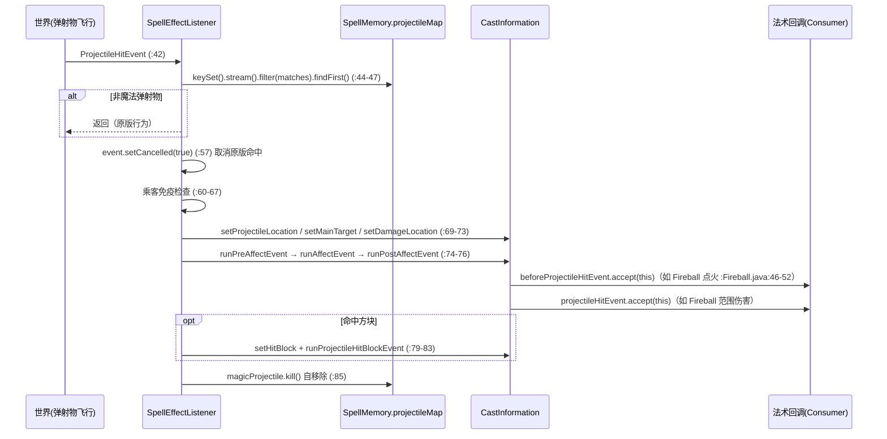
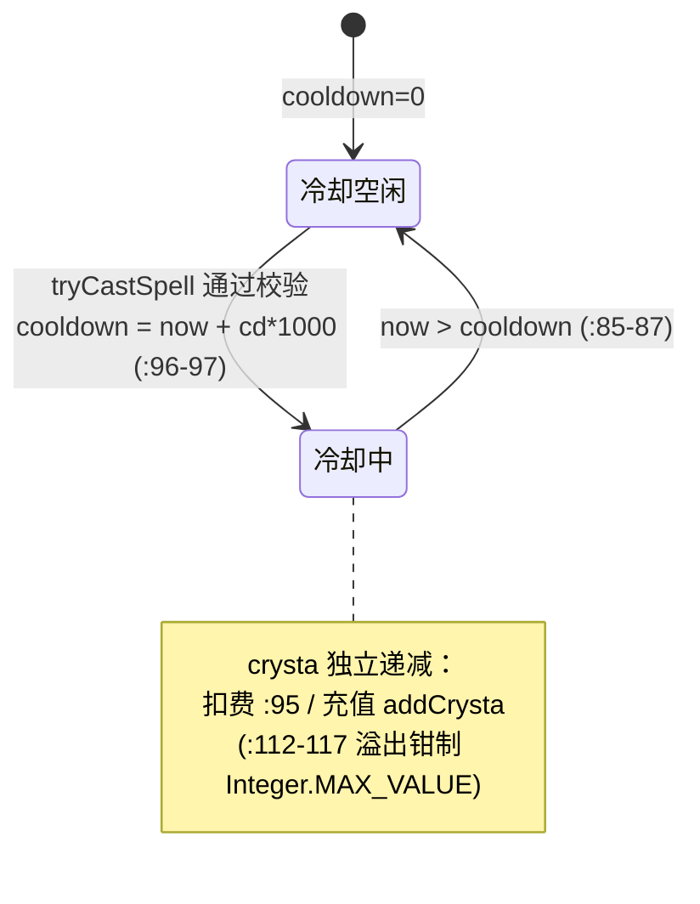
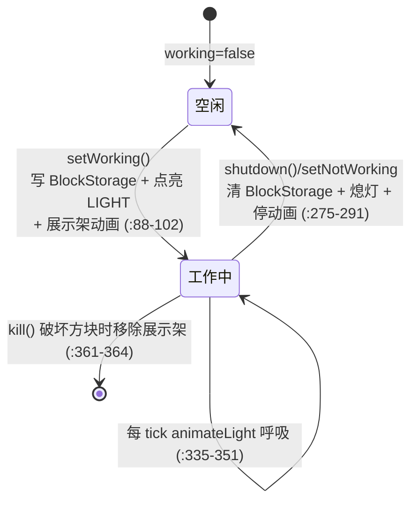

# CrystamaeHistoria 运行原理分析报告

> 分析时间：2026-08-16 13:19
> 本报告逐步骤拆解插件运行机制：启动流程、施法数据流（变量级）、故事生产管线、机械 tick 状态机、周期任务清理链、错误处理体系。

---

## 1. 启动流程溯源

### 1.1 配置加载（ConfigManager）

`ConfigManager` 构造器加载 5 个 YAML（`ConfigManager.java:29-35`）：

| 文件 | 默认值合并 | 用途 |
|------|-----------|------|
| `blocks.yml` | ✅ true | 方块→故事定义（tier + elements + 独特故事） |
| `generic-stories.yml` | ✅ true | COMMON..MYTHICAL 五档通用故事池 |
| `player_stats.yml` | ❌ | 玩家统计（解锁/使用次数） |
| `block_colors.yml` | ❌ | 方块染色映射 |
| `spells.yml` | ❌ | 法术启用开关 |

`getConfig(fileName, updateWithDefaults)`（`ConfigManager.java:39-62`）流程：文件不存在则创建（`:44-50`）→ `YamlConfiguration.loadConfiguration`（`:51`）→ 若需默认值合并则 `updateConfig`（`:55-57`）从 jar 资源读默认值 `addDefaults` + `copyDefaults(true)` + `save`（`:64-76`）。jar 内资源缺失时安全跳过（`:67-70`）。

`loadConfig()`（`:85-104`）遍历全部 `SpellType`：缺失的写 `spells.yml` 默认 true（`:89-97`）→ 读取启用状态写入 `Spell.enabled` 字段（`:98-99`）→ 启用的法术向液化池注册配方 `LiquefactionBasinCache.addSpellRecipe`（`:100-102`）。

### 1.2 故事域构建（StoriesManager 构造序列，`StoriesManager.java:58-63`）

```text
1. fillBlockTierMap()      (:93-174)  硬编码 5 个 BlockTier
2. fillStories()           (:176-198) 解析 generic-stories.yml 五档 → 5 张 storyMap
3. buildStoryTypeIndex()   (:65-71)   构建 稀有度×类型 二级索引（运行期 O(1) 查表）
4. fillBlockDefinitions()  (:200-274) 解析 blocks.yml → blockDefinitionMap + storyMapUnique
```

**BlockTier 数值表**（`StoriesManager.java:93-174`，chances 顺序 = basic/uncommon/rare/epic/mythical，构造校验和=100，`StoryChances.java`）：

| Tier | chroniclingChance | min/max 故事数 | C/U/R/E/M 概率 |
|------|------------------|---------------|----------------|
| 1 | 700 | 1–3 | 85/15/0/0/0 |
| 2 | 600 | 2–3 | 70/25/5/0/0 |
| 3 | 500 | 2–4 | 50/35/10/5/0 |
| 4 | 400 | 3–5 | 25/40/20/10/5 |
| 5 | 300 | 4–5 | 5/30/30/20/15 |

> ⚠️ 文档不一致：`BlockTier.java:11-13` 注释称 "X in 1000 chance"，而实际判定使用 `testChance(req, 10000)`（`ChroniclerPanelCache.java:314`），即 T1 面板每 tick 7% 概率。**潜在缺陷标记：注释与实现分母不一致**。

**fillBlockDefinitions 的容错链**（`StoriesManager.java:200-274`）：section 缺失→跳过并日志（`:205-210`）→ story 节缺失→跳过（`:212-219`）→ name 缺失→跳过（`:224-229`）→ material 非法→跳过（`:231-236`）→ 非法元素名剔除（`:245-250`）→ tier 非法→跳过（`:252-260`）。每个跳过路径都有日志，最终输出统计（`:271-273`）。

### 1.3 周期任务注册（RunnableManager，`RunnableManager.java:18-29`）

| 任务 | 首延 | 周期 | 职责 |
|------|------|------|------|
| `TemporaryEffectsRunnable` | 1 tick | **20 tick（1 秒）** | 11 项法术残留清理（`TemporaryEffectsRunnable.java:9-24`） |
| `SaveConfigRunnable` | 1 tick | **12000 tick（10 分钟）** | 定期落盘统计 |
| `ParticleDisplayRunnable` | 1 tick | **80 tick（4 秒）** | 悬浮粒子 |

### 1.4 可选插件守卫（SupportedPluginManager）

构造器同步检测 Netheopoiesis（`SupportedPluginManager.java:48`），其余 4 项（ExoticGarden/SlimeTinker/HeadLimiter/Networks）延迟 1 tick 检测（`:47, 51-56`）——避免加载顺序问题。所有集成消费点均有布尔守卫（如 `markIgnoreDamage` 仅在 slimeTinker=true 时写 PDC，`:74-79`）。

---

## 2. 核心数据流一：施法（Casting）

### 2.1 完整请求生命周期

```mermaid
flowchart TD
    A[玩家右键/左键手持法杖<br/>PlayerInteractEvent] --> B{主手事件?<br/>SpellCastListener.java:29-31}
    B --|副手| Z1[返回：避免双次触发]
    B --|主手| C{物品是 Stave?<br/>:34-35}
    C --|否| Z2[返回]
    C --|是| D[SpellSlot.getByPlayerAndAction<br/>解析 4 栏位之一 :39]
    D --|null 如 PHYSICAL| Z3[返回：免 PDC 反序列化]
    D --|有效槽| E["staveMeta = stack.getItemMeta()<br/>（整个交互唯一一次克隆）:46"]
    E --> F["InstanceStave.forSlot(stack, slot, meta)<br/>单槽 PDC 反序列化 :47"]
    F --> G["new CastInformation(player, stave.getLevel())<br/>记录 caster UUID + 施法位置快照 :48"]
    G --> H["tryCastSpell(slot, ci)<br/>→ InstancePlate.tryCastSpell"]
    H --> I{法术启用? :75-77}
    I --|否| FAIL1[CAST_FAIL: SPELL_DISABLED]
    I --|是| J{crysta ≥ 消耗? :80-82}
    J --|否| FAIL2[CAST_FAIL_NO_CRYSTA]
    J --|是| K{冷却到期? :85-87}
    K --|否| FAIL3[ON_COOLDOWN]
    K --|是| L["freezeTargetsOnCast()<br/>单次 rayTraceBlocks(50) 冻结视线目标 :92"]
    L --> M["先扣费：crysta -= cost<br/>cooldown = now + cd*1000 :95-97"]
    M --> N["PlayerStatistics.addUsage :98"]
    N --> O["spell.castSpell(ci) :100<br/>（try-catch 断路器 :99-108）"]
    O --> P{施法结果}
    P --|CAST_SUCCESS| Q["forWriteBack 全量重读+合并扣减板 :51-52"]
    Q --> R["PDC 写回 + buildLore 同一 meta :55-62"]
    R --> S["action bar 释放法术提示 :64-66"]
    P --|失败| T["action bar 施法失败+原因 :68-70"]
```

### 2.2 变量级数据变换：`InstancePlate.tryCastSpell()`（`InstancePlate.java:70-110`）

| 步骤 | 变量 | 类型 | 值/状态变化 | 代码位置 |
|------|------|------|------------|---------|
| 入口 | `castInformation` | `CastInformation` | `{caster:UUID, staveLevel:1-5, castLocation:克隆的玩家位置, currentTick:1}` | 构造 `CastInformation.java:65-69` |
| 1 | `spell` | `Spell` | `storedSpell.getSpell()` 单例引用 | InstancePlate.java:71 |
| 2 | `crystaCost` | `int` | `getCrystaCost(ci)`：若 `crystaMultiplied` 则 ×staveLevel | InstancePlate.java:72；缩放公式 `Spell.java:141-143` |
| 3 | `this.crysta` | `int` | `5 → 4`（扣费，例如 cost=1） | InstancePlate.java:95 |
| 4 | `this.cooldown` | `long` | `0 → now + cooldownSeconds*1000` | InstancePlate.java:96-97 |
| 5 | `targetRayTraceOnCast` | `RayTraceResult` | `null → 冻结`（`targetsResolved=true` 幂等） | CastInformation.java:90-102 |
| 6 | `castInformation.spellType` | `SpellType` | `null → storedSpell` | InstancePlate.java:89 |
| 7 | player_stats.yml | YML path | `<uuid>.SPELL.<id>.TIMES_CAST: n → n+1` | PlayerStatistics.java:42-49 |

**失败关闭语义**（`InstancePlate.java:93-94` 注释）：先扣费再施法——法术回调抛异常时消耗与冷却已生效，防止零成本无限重试；异常被 try-catch 断路器捕获（`:99-108`），且 `LOGGED_FAILED_SPELLS`（ConcurrentHashMap.newKeySet，`:28`）限制同一法术只记首次异常，防日志风暴。

### 2.3 `Spell.castSpell()` 三路分派（`Spell.java:87-108`）

```text
castSpell(ci)
├── isInstantCast?    → instantCastEvent.accept(ci)                     (:89-91)
├── isProjectileSpell?
│   ├── fireProjectileEvent.accept(ci)                                   (:93-94)
│   ├── isProjectileVsEntitySpell? → 注入 before/hit/after 三回调到 ci   (:95-99)
│   └── isProjectileVsBlockSpell?  → 注入 hitBlock 回调                  (:100-102)
└── isTickingSpell?   → registerTicker(ci, tickInterval, numberOfTicks)  (:105-107)
```

`registerTicker`（`Spell.java:119-128`）的等级缩放：`tickAmount ×= staveLevel`（若 multiplied）、`period ×= staveLevel`（若 intervalMultiplied）→ 注入 tickEvent/afterTicksEvent → 创建 `SpellTickRunnable` 注册进 `SpellMemory.tickingCastables` → `runTaskTimer(plugin, 0, period)`。

### 2.4 弹射物命中回流（SpellEffectListener.onProjectileHit，`SpellEffectListener.java:41-86`）



**权限闸门**：`entityHitAllowed`（`SpellEffectListener.java:113-124`）经 `GeneralUtils.hasPermission`（Slimefun 保护管理器，区分 `ATTACK_PLAYER/ATTACK_ENTITY`，`:118`）后才回调伤害链——PvP 区/领地保护生效。

### 2.5 涓流任务（SpellTickRunnable 与周期驱动）

`SpellMemory.removeProjectiles(false)`（每秒由 `TemporaryEffectsRunnable` 驱动，`SpellMemory.java:112-140`）对存活弹射物调用 `magicProjectile.run()`（`:128-132`）——即挂载的拖尾粒子 Consumer（`:125-131` 注释：StarFall/Chaos/Hellscape 的周期效果由该路径驱动）。

---

## 3. 核心数据流二：故事生产管线（业务主线）

```mermaid
flowchart LR
    subgraph P1[记录者面板 ChroniclerPanel]
        A1[物品丢入/放入输入槽] --> A2["makeStoried: 锁定故事潜力<br/>（随机 min..max 个槽位）"]
        A2 --> A3["每 tick testChance(chance,10000)<br/>成功→requestNewStory"]
        A3 --> A4["稀有度滚动 rnd 1..100<br/>→ addStory(rarity, pool)"]
        A4 --> A5["applyStory: PDC 追加 Story<br/>+ incrementStoryAmount"]
        A5 --> A6{剩余槽位=0?}
        A6 --|是| A7["requestUniqueStory<br/>+ 玩家解锁统计 + 闪电特效"]
    end
    subgraph P2[现实祭坛 RealisationAltar]
        B1["满故事物品放入<br/>isStoried && !hasRemaining"] --> B2["逐故事提取能量<br/>→ 生成对应类型水晶簇"]
        B2 --> B3[破坏水晶簇 → Crystal 掉落]
    end
    subgraph P3[液化池 LiquefactionBasin]
        C1[水晶投入 → contentMap<br/>StoryType→体积] --> C2[展示架皮革帽混色<br/>+ 液位升降]
        C2 --> C3{投入催化剂}
        C3 --|空白法术板| C4["top-3 类型匹配<br/>RecipeSpell → ChargedPlate"]
        C3 --|充能法术板| C5["匹配同法术 → addCrysta(液量)<br/>不匹配→销毁全部液体"]
        C3 --|其他物品| C6["RecipeItem 匹配 → 掉落造物<br/>（含背包升级链）"]
    end
    A7 --> B1
    B3 --> C1
    C4 --> D[StaveConfigurator 装配进法杖]
    D --> E[施法（见 §2）]
```

### 3.1 ChroniclerPanelCache.process() 决策树（`ChroniclerPanelCache.java:156-206`）

```text
process() 每 tick
├── 输入槽空?
│   ├── tier≥5 → tryInsertItem() 吸取掉落物 (:161-165, 208-234)
│   └── 否则 → return
├── inputItem != verdictItem? → refreshVerdict(inputItem) 单次 meta 判定 (:169-171)
├── !verdictCanBeStoried → reject(弹出物品) + shutdown (:173-177)
├── rejectOverage: 堆叠>1 弹出多余 (:179)
├── !verdictStoried → makeStoried + refreshVerdict (:181-185)
├── !verdictHasRemaining → (tier≥5: pushOutItem) + shutdown (:187-193)
├── workingOn != inputItemType? → setWorking(切换工作状态+展示架) (:197-200)
└── 否则 → animateLight + processStack (:202-205)
```

### 3.2 processStack 的概率与终结（`ChroniclerPanelCache.java:306-333`）

| 变量 | 类型 | 变换 | 位置 |
|------|------|------|------|
| `req` | `int` | `blockDefinition.getBlockTier().chroniclingChance`（700..300） | `:313` |
| 判定 | `boolean` | `GeneralUtils.testChance(req, 10000)` | `:314` |
| 故事稀有度 | `StoryRarity` | `rnd∈[1,100]` 依次对照 mythical→epic→rare→uncommon→common 累积门槛 | `StoryUtils.java:275-287` |
| 选中类型 | `StoryType` | `pool.get(nextInt(0, pool.size()))` 从方块元素池选 | `StoryUtils.java:292` |
| 选中故事 | `Story` | `storiesByRarityAndType[rarity][type]` 随机取 | `StoryUtils.java:294-300` |
| PDC | `List<Story>` | 追加 + `JS_S_AS` 计数 +1 | `StoryUtils.java:306-315, 323-325` |
| 视觉 | — | 闪电特效 `strikeLightningEffect`（纯视觉） | `ChroniclerPanelCache.java:328` |
| 备忘录 | — | `verdictItem = null` 显式失效 | `:330` |

**终结条件**（`:317-326`）：`remaining == 1` 时（本次是最后一故事）→ `requestUniqueStory`（方块专属独特故事，`StoryUtils.java:351-360`）→ `PlayerStatistics.unlockUniqueStory + addChronicle`（归属 `activePlayer`）。

**潜在缺陷标记**：`refreshVerdict` 中 `verdictRemaining = getMaxStoryAmount(meta) - getStoryAmount(meta)`（`:302`），而 `processStack` 使用的 `remaining` 语义是"扣除本次前"的值——当 `remaining==1` 时写入最后一故事后 `hasRemaining` 将为 false，逻辑自洽；但 `requestNewStory` 在 `addStory` 因空池跳过时（`StoryUtils.java:297-299`）仍会走 `rebuildStoriedStack` 与闪电特效（`:327-328`）——**视觉反馈与实际写入可能不一致（空池时假闪电）**，属轻微 UX 缺陷。

### 3.3 液化池配方匹配（LiquefactionBasinCache）

- 液体模型：`Map<StoryType, Integer> contentMap`（`LiquefactionBasinCache.java:63`），水晶投入按稀有度折算体积（COMMON=1/UNCOMMON=3/RARE=10/EPIC=25/MYTHICAL=50/UNIQUE=2，`Crystal.java:19-26`），超容量则弹飞（`:143-145`）。
- 配方匹配：取含量 top-3 的 `Set<StoryType>`（`:229-233`），对 `RECIPES_SPELL` 线性扫描 `recipeMatches(set, plateTier)`（`:374-383`）——69 个法术 × O(1) 集合比较。
- 展示混色：RGB 加权平均→皮革帽颜色（`:157-189`）；液位映射 `[-1.7,-1]` 线性插值（`:212-219`）。
- 失败惩罚：投入催化剂后无论匹配与否 `emptyBasin()` 清空全部液体（`:252, 301`）——"错误的配方导致材料损失"（README 惩罚设计）。

---

## 4. 状态管理分析

### 4.1 应用状态：SpellMemory（13 张表，`SpellMemory.java:29-53`）

| 映射表 | Key → Value | 过期语义 | 清理方法 |
|--------|------------|---------|---------|
| `projectileMap` | MagicProjectile → (CastInformation, Long) | 到期 kill + 存活 run | `removeProjectiles`（:112-140） |
| `fallingBlockMap` | MagicFallingBlock → (CI, Long) | 到期 kill | `:142-156` |
| `strikeMap` | UUID → (CI, Long) | 未被事件消费的残留清理 | `:207-220` |
| `tickingCastables` | SpellTickRunnable → Integer | tick 数耗尽自取消 | clearAll 取消（:57-60） |
| `blocksToRemove` | BlockPosition → Long | 到期置 AIR；世界卸载保留待重载 | `:187-205`（IllegalStateException 守卫） |
| `summonedEntities` | MagicSummon → Long | 到期/主人离线 kill | `:158-185` |
| `playersWithFlight` | UUID → Long | 到期关闭飞行；离线亦移除 | `:222-240` |
| `playersWithFrozenTime` | UUID → Long | resetPlayerTime | `:242-259` |
| `playersWithFrozenWeather` | UUID → Long | resetPlayerWeather | `:261-278` |
| `inhibitedEndermen` | UUID → Long | 到期移除 | `:280-292` |
| `noSpawningAreas` | BoundingBox → Long | 到期解除 | `:294-306` |
| `displayItems` | DisplayItem → Long | 到期 kill+显式移除 | `:308-324` |
| `sleepingBags` | UUID → Location | 无过期，关闭时全置 AIR | `:326-334` |

**过期模型统一为 `System.currentTimeMillis()` 时间戳**；清理由 `TemporaryEffectsRunnable` 每秒驱动（`TemporaryEffectsRunnable.java:9-24` 顺序调用 11 个清理器）。`clearAll(true)` 用于 `onDisable` 全量回收（`SpellMemory.java:55-110`）。

**并发要点**：所有表为普通 HashMap，但 Bukkit 主线程单线程模型下访问（机械 tick、事件、施法均在主线程），唯一例外是 `InstancePlate.LOGGED_FAILED_SPELLS` 使用并发 Set（`InstancePlate.java:28`）。

### 4.2 状态机提取

**状态机 A：InstancePlate（法术板充能/冷却，`InstancePlate.java:30-35`）**



**状态机 B：ChroniclerPanelCache（面板工作状态，`ChroniclerPanelCache.java:88-102, 249-291`）**



持久化：`BS_CP_WORKING_ON`（材质字符串）与 `BS_CP_ACTIVE_PLAYER`（UUID）写 BlockStorage，重启后构造器恢复并容忍损坏值（`:67-85` 两段 try-catch 降级）。

**状态机 C：CastResult（施法结果枚举，`CastResult.java:6-10`）**：`CAST_SUCCESS / CAST_FAIL_NO_CRYSTA / CAST_FAIL_SLOT_EMPTY / ON_COOLDOWN / SPELL_DISABLED`，各带中文 action bar 文案。

### 4.3 持久化层

| 数据 | 载体 | 写入点 | 读取点 |
|------|------|--------|--------|
| 故事物品 | ItemStack PDC（`PDC_STORIES` 列表 + `PDC_POTENTIAL_STORIES` JSON + `PDC_CURRENT_NUMBER_OF_STORIES` int + `PDC_IS_STORIED` bool） | `StoryUtils.applyStory/makeStoried/setStoryAmount` | `StoryUtils.getAllStories/getMaxStoryAmount` |
| 法杖 | PDC `PDC_STAVE_STORAGE` → `Map<SpellSlot, InstancePlate>` | `SpellCastListener.java:55-63`（单 meta 往返） | `InstanceStave.forSlot/forWriteBack` |
| 机械 | Slimefun BlockStorage（`BS_CP_*`、`ch_c_lvl:*`、`ch_display_stand`） | `setWorking/syncBlock/getDisplayStand` | 各 Cache 构造器 |
| 玩家统计 | `player_stats.yml`（path: `<uuid>.<StatType>.<id>.<field>`） | `PlayerStatistics.*` | 同左 + GetRanks 命令 |
| 周期落盘 | `SaveConfigRunnable`（每 10 分钟）+ `saveAll()`（关服） | `ConfigManager.java:106-124` | — |

**满故事物品的视觉信号**：`setStoryAmount` 达上限时附加 `LUCK_OF_THE_SEA` 附魔 + `HIDE_ENCHANTS`（`StoryUtils.java:340-347`）——发光提示"可提取"。

### 4.4 生命周期钩子顺序（Bukkit/Slimefun）

| 钩子 | 注册顺序 | 处理逻辑 | 位置 |
|------|---------|---------|------|
| `BlockPlaceHandler` | ChroniclerPanel preRegister | 创建 Cache + 记录 activePlayer | `ChroniclerPanel.java:43-58` |
| `onNewInstance`（Slimefun 加载方块） | 区块加载时 | 恢复缺失 Cache | `ChroniclerPanel.java:79-85` |
| `BlockTicker.tick` | 每 Slimefun tick | 委托 `cache.process()`（同步执行 `synchronous()=true`） | `ChroniclerPanel.java:100-112`、`TickingMenuBlock.java:29-45` |
| `BlockBreakHandler`（onBreak） | 破坏时 | kill cache + 无条件掉落输入槽 | `ChroniclerPanel.java:87-98` |
| `PlayerQuitEvent` | 退出 | `removeFlight(player)` | `SpellEffectListener.java:209-212` |
| `onDisable` | 关服 | cache.shutdown + spellMemory.clearAll + saveAll | `CrystamaeHistoria.java:201-212` |

监听器优先级：法术效果类统一 `EventPriority.HIGH, ignoreCancelled = true`（`SpellEffectListener.java:41,88,126,146,166,182,191`）。

---

## 5. 错误处理体系

### 5.1 三层防御结构

```text
第 1 层：不可信输入解析降级（PDC/BlockStorage/YAML 均不可信）
├── InstanceStave 构造器：PDC 损坏→按空法杖 (:52-57)
├── forWriteBack：PDC 损坏→返回 null 跳过写回（绝不以空映射覆写）(:107-111)
├── StoryUtils.getMaxStoryAmount：JSON 异常→按 0 槽位 (:216-252 两版重载)
├── ChroniclerPanelCache 构造器：材质/UUID 损坏→重置/忽略 (:67-85)
├── LiquefactionBasinCache.processChargedPlate：PDC 损坏→销毁物品+告警 (:268-274)
└── StoriesManager.fillBlockDefinitions：六段校验链（§1.2）

第 2 层：运行期断路器
├── InstancePlate.tryCastSpell：法术回调异常→吞异常+日志限流 (:99-108)
├── SpellMemory.removeBlocks：世界卸载 IllegalStateException→保留条目下轮重试 (:196-203)
└── setupSlimefun：NetheoPlants NoClassDefFoundError→severe 日志 (:224-230)

第 3 层：全局兜底
├── onEnable 前置：非 Paper→禁用自身 (:157-169)
└── onDisable：全量清理（幂等，instance null 守卫 :203）
```

### 5.2 错误传播风格

- **无自定义异常类型**：以返回值枚举（`CastResult`）+ 日志 + 静默降级为主。
- **日志限流**：`LOGGED_FAILED_SPELLS`（`InstancePlate.java:28, 104`）。
- **重试策略**：仅 `removeBlocks` 的"保留条目待世界重载"是一种惰性重试（每秒重扫）；无退避/熔断库。

---

## 6. 异常恢复路径表（核心流程）

| 流程步骤 | 失败点 | 处理方式 | 恢复策略 | 位置 |
|---------|--------|---------|---------|------|
| 施法 | 法术回调抛异常 | try-catch 断路器 | 扣费不回滚，按成功返回（防零成本重试） | InstancePlate.java:99-108 |
| 施法写回 | PDC 反序列化失败 | 返回 null | 跳过写回保持原数据 | InstanceStave.java:97-118 |
| 机械 tick | 判定 JSON 损坏 | 按 0 槽位 | 物品被弹出，机械不卡死 | StoryUtils.java:216-252 |
| 机械 tick | 世界卸载 | catch IllegalStateException | 条目保留，重载后下轮清理 | SpellMemory.java:196-203 |
| 机械恢复 | BlockStorage 材质损坏 | 重置工作状态 | warning 日志 + 继续 | ChroniclerPanelCache.java:67-76 |
| 破坏面板 | Cache 缺失 | 仍无条件掉落输入槽 | 玩家物品不丢失 | ChroniclerPanel.java:96-97 |
| 玩家离线 | 飞行/时间/天气残留 | Bukkit.getPlayer null 检查 | 离线即移除条目防泄漏 | SpellMemory.java:230-237 等 |
| 召唤物主人离线 | tick 消费者 NPE 风险 | 离线判 kill | 与 mobgoals 自毁语义一致 | SpellMemory.java:170-177 |

---

## 7. 运行原理总结

1. **一切状态皆时间戳**：13 张 SpellMemory 表 + 法术板冷却 + gadget expiryMap 全部采用 `System.currentTimeMillis()` 绝对到期时间 + 每秒集中扫描的统一过期模型。
2. **一切物品数据皆 PDC**：故事/法杖/法术板/背包的自定义状态全部编码进 ItemStack 的 PersistentDataContainer，物品即存档。
3. **先校验后执行、先扣费后施法**：施法链的前置校验顺序（禁用→晶能→冷却）与失败关闭的扣费顺序是本项目正确性的两根支柱。
4. **备忘录 + 懒计算是性能基石**：机械判定、raycast、Location 克隆均以"实例未变即复用"或"首次读取才计算"模式消除每 tick 重复工作（详见 01 报告 §7）。
5. **唯一确认缺陷**：`BlockTier.java:11-13` 注释（1000 分母）与 `ChroniclerPanelCache.java:314` 实现（10000 分母）不一致；以及空故事池时的假闪电视觉（§3.2）。
