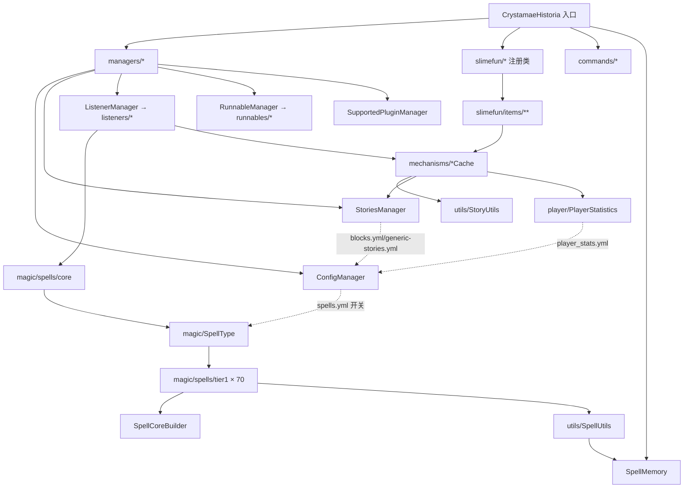

# CrystamaeHistoria（魔法水晶编年史）— 项目架构报告

**分析时间**：2026-08-15_011442
**分析范围**：`/f/Github/repo/CrystamaeHistoria-1.21.11`（即当前仓库根目录）
**分析模式**：完整分析（255 个 Java 文件，属中型项目）

---

## 1. 技术栈全景

### 编程语言

| 语言 | 文件数 | 代码行数 | 主要用途 |
|------|--------|---------|---------|
| Java 11（`maven-compiler-plugin` source/target 11，见 `pom.xml:96-97`；properties 中遗留 1.8 声明见 `pom.xml:11-12`，被 compiler plugin 覆盖） | 255 | ~28,497（`wc -l` 全量统计） | 全部插件逻辑 |
| YAML（resources） | 7 | blocks.yml 约 354KB、block_colors.yml 约 30KB | 配置与数据定义 |
| YAML（CI/GitHub） | 4 | — | GitHub Actions、Issue 模板 |

### 运行平台与核心框架

| 技术 | 版本 | 用途 | 来源 |
|------|------|------|------|
| Paper API | `1.19-R0.1-SNAPSHOT`（provided） | Minecraft 服务端 API（Paper 专属特性，启动时强制检查，见 `CrystamaeHistoria.java:163-175`） | `pom.xml:118-123` |
| Slimefun4 | `2024.3.1`（provided，SlimefunGuguProject 分支） | 附属插件宿主框架（物品注册、方块存储 BlockStorage、BlockMenu GUI、研究系统） | `pom.xml:124-129` |
| InfinityLib | `1.3.9`（compile，shade 重定位） | 附属脚手架：`AbstractAddon` 基类、`TickingMenuBlock` 机械基类、命令框架 | `pom.xml:217-222`；标注"To be removed, do not use further" |
| EffectLib | `10.3`（compile，shade） | 粒子特效（如 `SphereEffect`，见 `LiquefactionBasinCache.java:421`） | `pom.xml:191-196` |
| bStats | `3.0.0`（compile，shade 重定位） | 匿名统计（Metrics id `12065`，见 `CrystamaeHistoria.java:205`） | `pom.xml:132-137` |
| MorePersistentDataTypes | `2.4.0`（compile） | 扩展 PDC 数据类型 | `pom.xml:159-164` |
| Lombok | `1.18.34`（provided） | `@Getter/@Setter/@UtilityClass` 等样板消除 | `pom.xml:153-158` |
| GuizhanLibPlugin | `2.3.0`（provided，硬依赖） | 汉化工具库 + 自动更新器 `GuizhanUpdater`（`CrystamaeHistoria.java:178`） | `pom.xml:224-230` |

### 可选集成插件（provided，softdepend）

mcMMO `2.1.217`、ExoticGarden、Networks、WildStackerAPI `2022.6`、RoseStacker `1.5.1`、Netheopoiesis（下界乌托邦）——见 `pom.xml:166-214` 与 `src/main/resources/plugin.yml`（`softdepend` 列表）。`plugin.yml` 中 `depend: [Slimefun, GuizhanLibPlugin]`。

### 构建与工具链

- **构建工具**：Maven（`pom.xml`），`defaultGoal = clean package`（`pom.xml:101`）
- **打包**：`maven-shade-plugin 3.4.1`，启用 `minimizeJar`，重定位 `io.github.mooy1.infinitylib`、`org.bstats`、`de.slikey`（EffectLib）三个包（`pom.xml:46-90`）
- **资源过滤**：`src/main/resources` 全量 filtering（用于 `plugin.yml` 的 `${project.version}` 注入，`pom.xml:104-113`）
- **版本号**：`<version>MODIFIED</version>`（`pom.xml:8`）——该 fork 不使用 SemVer，版本由 CI 构建号注入（`Build #N` 格式，与自动更新判断 `startsWith("Build")` 配套，见 `CrystamaeHistoria.java:177`）
- **CI**：GitHub Actions `Java CI`，仅 `mvn package`（`.github/workflows/maven.yml`）
- **许可**：GPLv3（`LICENSE` 首行）

### 仓库血缘（重要架构上下文）

本仓库是**三层 fork**：
1. 原作者：[Sefiraat/CrystamaeHistoria](https://github.com/Sefiraat/CrystamaeHistoria)（英文上游，420 次提交）
2. 汉化维护：[SlimefunGuguProject/CrystamaeHistoria](https://github.com/SlimefunGuguProject/CrystamaeHistoria)（`upstream` remote，通过 `.github/pull.yml` 自动从 `Sefiraat:master` 合并，assignee `ybw0014`）
3. 本地工作副本：`origin = https://github.com/hershate/CrystamaeHistoria-1.21.11.git`（面向 1.21.11 服务端的适配工作区）

---

## 2. 目录结构与功能角色

```
CrystamaeHistoria-1.21.11/
├── pom.xml                                # [构建配置] Maven 构建 + shade 打包
├── README.md                              # [文档] 中文玩法说明
├── .github/
│   ├── workflows/maven.yml                # [CI] 仅构建，无测试
│   ├── pull.yml                           # [工作流] 上游自动同步配置
│   ├── CODEOWNERS                         # [工作流] *.java → @SlimefunGuguProject/code-reviewers
│   └── ISSUE_TEMPLATE/                    # [工作流] bug-report.yml（中文）
├── REF/Slimefun4.1/                       # [本地参考] Slimefun 源码参考副本（已被 .gitignore 排除，不属于本项目源码）
├── images/                                # [资源] Wiki 图片（README 引用）
└── src/main/
    ├── java/io/github/sefiraat/crystamaehistoria/
    │   ├── CrystamaeHistoria.java         # 【入口层】插件主类（11.2K）
    │   ├── SpellMemory.java               # 【状态层】法术运行时内存状态仓库（13 个 Map）
    │   ├── commands/        (5 文件)       # 【接口层】/historia 子命令
    │   ├── listeners/       (17 文件)      # 【接口层】Bukkit 事件监听器
    │   ├── magic/           (4 文件)       # 【领域层】法术抽象：SpellType 枚举、CastInformation、CastResult、DisplayItem
    │   │   └── spells/
    │   │       ├── core/    (5 文件)       # 【领域层】Spell/SpellCore/SpellCoreBuilder/InstancePlate/InstanceStave
    │   │       ├── spellobjects/ (3 文件)  # 【领域层】MagicProjectile/MagicFallingBlock/MagicSummon
    │   │       └── tier1/   (70 文件)      # 【领域层】70 个具体法术实现
    │   ├── managers/        (5 文件)       # 【业务层】Config/Listener/Runnable/Stories/SupportedPlugin 管理器
    │   ├── player/          (5 文件)       # 【业务层】PlayerStatistics + 4 个 Rank 体系
    │   ├── runnables/       (3+3 文件)     # 【调度层】周期任务（含 spells/ 子包）
    │   ├── slimefun/        (12 文件)      # 【注册层】10 个静态 setup() 物品注册类 + CrystaStacks(物品栈定义) + CrystaRecipeTypes
    │   │   ├── itemgroups/  (6 文件)       # 【表现层】Slimefun 指南 Flex GUI（法术集/故事集/镀金集）
    │   │   ├── items/                      # 【表现层】物品实现
    │   │   │   ├── mechanisms/ (5 子包)    # 【核心机制】记录者面板/现实祭坛/液化池/法杖配置器/棱镜镀金器（各含 *Cache）
    │   │   │   ├── tools/     (6 子包)     # 法杖/法术板/背包/覆盖物/合成材料
    │   │   │   ├── materials/              # 水晶等基础材料
    │   │   │   ├── gadgets/                # 小道具
    │   │   │   └── artistic/               # 艺术品（画刷等）
    │   │   └── types/       (2 文件)       # 自定义 SlimefunItem 类型
    │   ├── stories/         (4+5 文件)     # 【领域层】故事模型 + definition/（StoryType/StoryRarity/StoryChances 等）
    │   └── utils/           (13+8+11+2 文件)# 【基础设施层】工具类、PDC 数据类型、AI 目标、主题
    └── resources/
        ├── plugin.yml                     # 插件元数据（main 类、depend、命令）
        ├── config.yml                     # auto-update + 消息配置
        ├── blocks.yml     (354KB)         # 【数据】全部方块的故事定义（tier/elements/unique story）
        ├── generic-stories.yml (8.4KB)    # 【数据】5 个稀有度池的通用故事文本
        ├── block_colors.yml (30KB)        # 【数据】方块颜色（用于粒子/显示）
        ├── player_stats.yml (0B)          # 【运行时生成】玩家统计持久化
        ├── spells.yml     (0B)            # 【运行时生成】法术启用开关
        └── tags/          (~40 JSON)      # 方块标签（铜块/混凝土等分组，供法术使用）
```

### 分层角色总结

| 层 | 目录 | 职责 |
|----|------|------|
| 入口层 | `CrystamaeHistoria.java` | 生命周期（`enable()`/`disable()`）、全部 manager 装配、静态门面 |
| 状态层 | `SpellMemory.java` | 法术产生的所有临时运行时状态（投射物/掉落方块/召唤物/飞行/时间冻结…），含过期清理 |
| 领域层 | `magic/`、`stories/` | 法术三元组（Spell+SpellCore+CastInformation）、故事模型（Story/BlockDefinition/BlockTier） |
| 注册层 | `slimefun/` | 以静态 `setup()` 向 Slimefun 注册全部物品/配方/研究 |
| 表现层 | `slimefun/items/`、`itemgroups/` | 机械方块（TickingMenuBlock）、GUI、物品行为 |
| 调度层 | `runnables/` | Bukkit 定时任务 |
| 接口层 | `listeners/`、`commands/` | 事件入口 |
| 基础设施层 | `utils/` | PDC 序列化、粒子、主题、权限、随机 |

---

## 3. 模块依赖关系

### 3.1 包级依赖图（基于 import 静态分析）



**依赖方向特征**：严格单向，无循环依赖。`magic/` 与 `stories/` 两个领域包互不直接依赖，仅通过 `slimefun/items/mechanisms/`（机制层）与 `utils/` 交汇——这是清晰的领域隔离。

### 3.2 静态门面模式（全局访问骨架）

`CrystamaeHistoria` 主类暴露 15 个静态访问器（`CrystamaeHistoria.java:65-152`）：`getInstance()`、`getConfigManager()`、`getStoriesManager()`、`getListenerManager()`、`getRunnableManager()`、`getSpellMemory()`、`getEffectManager()`、`getSupportedPluginManager()`、`getPluginManager()`，以及 4 个法术状态映射访问器（`getProjectileMap()`、`getFallingBlockMap()`、`getStrikeMap()`、`getSummonedEntityMap()`）和 3 个 `CastInformation` 提取器（`getProjectileCastInfo()` 等，带 `Preconditions.checkNotNull` 断言）。

**全项目通过静态门面解耦实例生命周期**——任何类均可 `CrystamaeHistoria.getXxx()` 获取管理器，无需依赖注入。

---

## 4. 架构模式分析

### 模式 1：插件生命周期 + 管理器中枢（Plugin + Manager Hub）
- **判断依据**：主类 `enable()`（`CrystamaeHistoria.java:154-202`）按固定顺序实例化 7 个管理器并调用各注册类的静态 `setup()`
- **特征**：初始化顺序即依赖顺序：ConfigManager → StoriesManager（读 config）→ ListenerManager → RunnableManager → SpellMemory → SupportedPluginManager → EffectManager → `loadConfig()` → `setupEnabledSpells()` → `setupSlimefun()` → bStats → 命令注册

### 模式 2：模板方法 + 缓存伴随（TickingMenuBlock + Cache Companion）
- **判断依据**：所有 5 个机械方块均继承 InfinityLib `TickingMenuBlock`，以相同骨架实现 `tick()/onNewInstance()/onBreak()/preRegister()`（如 `ChroniclerPanel.java:43-113`、`RealisationAltar.java:46-118`）
- **特征**：每个机械伴随一个 `*Cache` 类存放运行时状态；`static Map<Location, *Cache> CACHES` 全局注册表；放置时创建（`BlockPlaceHandler`）、区块加载时恢复（`onNewInstance`）、破坏时销毁（`onBreak` + `kill()`）。`AbstractCache`（`AbstractCache.java:16-38`）提供 `kill(Location)`（清 BlockStorage）与 `setActivePlayer()`（记录操作者 UUID 用于统计归属）

### 模式 3：枚举注册表 + 策略模式（Spell Registry）
- **判断依据**：`SpellType` 枚举（`SpellType.java:80-151`）一次性注册 70 个法术实例，每个枚举常量持有一个 `Spell` 子类实例；`SpellType.cast(CastInformation)` 委派到 `spell.castSpell()`
- **特征**：新增法术 = 新增 `tier1/Xxx.java` + 在枚举追加一行。法术行为通过 `SpellCore`（不可变参数+回调包）描述，`Spell.castSpell()`（`Spell.java:87-108`）根据 `SpellCore` 的布尔标志分派到三种执行路径（即时/投射物/tick）

### 模式 4：建造者模式（Builder）
- **判断依据**：`SpellCoreBuilder`（`magic/spells/core/SpellCoreBuilder.java`）以链式 API 构建 `SpellCore`；`SpellCore` 构造函数逐字段复制 builder（`SpellCore.java:58-99`）
- **特征**：每个法术在 `getSpellCore()` 中声明式描述自身（冷却/射程/消耗/伤害/事件回调），无命令式执行代码

### 模式 5：上下文对象模式（Context Object）
- **判断依据**：`CastInformation`（`CastInformation.java:16-111`）贯穿整个施法链：施法者 UUID、法杖等级、施法位置、命中位置、目标实体、6 个可注入的 `Consumer<CastInformation>` 事件回调
- **特征**：法术定义（SpellCore）把回调"装载"到 CastInformation 上（`Spell.java:96-103`），后续由监听器/Runnable 在事件发生时回调（`runPreAffectEvent()`/`runAffectEvent()`/`runTickEvent()` 等）

### 模式 6：观察者/事件驱动
- **判断依据**：17 个 Bukkit `Listener` 由 `ListenerManager` 构造时逐一注册（`ListenerManager.java:26-42`），注册顺序即代码书写顺序
- **特征**：跨模块通信全部经由 Bukkit 事件总线（如水晶收获：`RealisationAltarCache` 种下水晶芽 → 玩家破坏 → `CrystalBreakListener.onBreakCrystal()` 查所有祭坛缓存并掉落碎片，`CrystalBreakListener.java:23-66`）

### 模式 7：单例模式
- **判断依据**：`CrystamaeHistoria.instance` 静态字段（`CrystamaeHistoria.java:51`）；各机械的 `static CACHES` 映射；`LiquefactionBasinCache` 的 `static RECIPES_SPELL/RECIPES_ITEMS` 全局配方表（`LiquefactionBasinCache.java:61-62`）

---

## 5. 关键设计模式实例

| 模式 | 位置 | 代码示例 |
|------|------|---------|
| 静态门面/单例 | `CrystamaeHistoria.java:65` | `getInstance()` + 15 个静态访问器 |
| 建造者 | `SpellCore.java:58` | `new SpellCore(SpellCoreBuilder)` |
| 模板方法 | `ChroniclerPanel.java:99` / `RealisationAltar.java:68` | `tick(Block, BlockMenu) → cache.process()` |
| 注册表 | `SpellType.java:83-151` | 枚举常量 ×70，`getCachedValues()` 缓存 `values()` |
| 上下文对象 | `CastInformation.java:61-68` | 构造时快照玩家位置与视线目标块 |
| 缓存伴随 | `RealisationAltar.java:34` | `static Map<Location, RealisationAltarCache> CACHES` |
| 自定义持久化 | `utils/datatypes/*` | 8 个 `PersistentDataType` 实现（PDC 序列化） |
| 空对象/拒绝策略 | `ChroniclerPanelCache.java:207-213` | `reject()` 弹出非法输入物品 |

---

## 6. 函数级调用链（核心路径）

### 6.1 施法调用链（玩家点击法杖 → 法术效果）

```
SpellCastListener.onInteract(PlayerInteractEvent)            → listeners/SpellCastListener.java:25
  ├── SlimefunItem.getByItem(stack) instanceof Stave          → SpellCastListener.java:28-29
  ├── new InstanceStave(stack)                                → SpellCastListener.java:31
  │   └── DataTypeMethods.getCustom(meta, PDC_STAVE_STORAGE)  → InstanceStave.java:33-37 【从 PDC 反序列化 4 槽位法术板】
  ├── SpellSlot.getByPlayerAndAction(player, action)          → SpellCastListener.java:32 【左/右键×Shift 映射 4 槽位】
  ├── new CastInformation(player, stave.getLevel())           → CastInformation.java:62-68 【快照位置/视线块】
  ├── staveInstance.tryCastSpell(slot, castInformation)       → InstanceStave.java:78-85
  │   └── InstancePlate.tryCastSpell(castInformation)         → InstancePlate.java:64-90
  │       ├── 检查 spells.yml 启用开关                          → InstancePlate.java:69 【SPELL_DISABLED】
  │       ├── 检查 crysta 充能 ≥ 消耗                           → InstancePlate.java:74 【CAST_FAIL_NO_CRYSTA】
  │       ├── 检查冷却 cooldown > now                           → InstancePlate.java:79 【ON_COOLDOWN】
  │       ├── spell.castSpell(castInformation)                → Spell.java:87-108
  │       │   ├── [即时] instantCastEvent.accept()             → Spell.java:89-91
  │       │   ├── [投射物] fireProjectileEvent.accept()        → Spell.java:93-103
  │       │   │   └── (命中回调注入 castInformation)
  │       │   └── [tick] registerTicker()                     → Spell.java:105-128
  │       │       └── new SpellTickRunnable().runTaskTimer()   → runnables/spells/SpellTickRunnable.java
  │       ├── crysta -= cost; cooldown = now + cd             → InstancePlate.java:85-87
  │       └── PlayerStatistics.addUsage(caster, spellType)    → InstancePlate.java:88 → player/PlayerStatistics.java:45
  └── [成功] DataTypeMethods.setCustom(...) 回写 PDC + buildLore + ActionBar 消息
      [失败] ActionBar "施法失败: <CastResult.message>"        → SpellCastListener.java:51-55
```

**跨层调用标注**：`listeners → magic/spells/core`（接口层→领域层）、`InstancePlate → managers.ConfigManager`（领域层→业务层）、`InstancePlate → player.PlayerStatistics`（领域层→业务层）。
**异步点**：`SpellTickRunnable.runTaskTimer()`（Bukkit 同步定时任务，非线程异步；全部逻辑运行在主线程）。

### 6.2 故事发掘调用链（记录者面板 tick → 物品获得故事）

```
ChroniclerPanel.tick(block, blockMenu)                        → ChroniclerPanel.java:99-104 【Slimefun 每 tick 调用】
  └── ChroniclerPanelCache.process()                          → ChroniclerPanelCache.java:111-154
      ├── [无输入 & tier≥5] tryInsertItem()                    → ChroniclerPanelCache.java:156-182 【吸取地面掉落物】
      ├── StoryUtils.canBeStoried(item, tier+1)               → StoryUtils.java:45-50 【blocks.yml 定义+tier 校验】
      │   └── isAllowed(): 排除带 meta 物品/Slimefun 物品       → StoryUtils.java:74-82
      ├── [非法] reject(item) + shutdown()                     → ChroniclerPanelCache.java:123-126
      ├── rejectOverage(item) 弹出超额堆叠                      → ChroniclerPanelCache.java:129, 197-205
      ├── StoryUtils.makeStoried(item)                        → StoryUtils.java:102-107
      │   └── getInitialStoryLimits(): 随机锁定故事数量潜力      → StoryUtils.java:146-163 【minStories~maxStories】
      ├── [故事槽已满] pushOutItem()/shutdown()                 → ChroniclerPanelCache.java:135-140
      ├── [首次/换材料] setWorking(block, material)             → ChroniclerPanelCache.java:66-79
      │   ├── BlockStorage.addBlockInfo(BS_CP_WORKING_ON)     → ChroniclerPanelCache.java:73 【状态持久化】
      │   ├── 设置 LIGHT 方块 + startAnimation()（盔甲架浮动头） → ChroniclerPanelCache.java:74-77, 81-87
      │   └── blockDefinition = StoriesManager.map.get(material) → ChroniclerPanelCache.java:78
      └── [匹配工作中] animateLight() + processStack(item)      → ChroniclerPanelCache.java:150-153
          └── processStack()                                   → ChroniclerPanelCache.java:235-258
              ├── testChance(chroniclingChance, 10000)         → ChroniclerPanelCache.java:241 【万分比】
              ├── StoryUtils.requestNewStory(item)             → StoryUtils.java:206-225
              │   └── 按 StoryChances 累积概率选稀有度 → addStory(): 池内随机 StoryType + 随机故事文本 → applyStory() 写 PDC_STORIES
              ├── [最后一个故事] requestUniqueStory(item)        → StoryUtils.java:285-290 【方块专属故事】
              │   └── PlayerStatistics.unlockUniqueStory/addChronicle → PlayerStatistics.java:69, 118
              ├── StoriesManager.rebuildStoriedStack(item)     → StoriesManager.java:240-252 【重建 lore】
              └── strikeLightningEffect（闪电特效）              → ChroniclerPanelCache.java:255
```

### 6.3 水晶收获调用链（玩家破坏水晶芽 → 掉落故事碎片）

```
CrystalBreakListener.onBreakCrystal(BlockBreakEvent)          → CrystalBreakListener.java:23-30
  └── handleCrystal(block, manual)                            → CrystalBreakListener.java:52-66
      ├── 遍历 RealisationAltar.getCaches()（全部祭坛）          → CrystalBreakListener.java:54
      ├── cache.getCrystalStoryMap().remove(blockPosition)     → CrystalBreakListener.java:55
      ├── StoriesManager.getStory(id, rarity)                  → StoriesManager.java:263-280
      ├── story.getStoryShardProfile().dropShards(rarity, loc, gilded) → CrystalBreakListener.java:60 【掉落水晶碎片】
      └── cache.saveMap()（写区块 PDC）                         → RealisationAltarCache.java:188-200
```

---

## 7. 架构健康度评估

| 维度 | 评分（1-5） | 说明 |
|------|------------|------|
| 模块化程度 | 4 | magic/stories/slimefun 领域边界清晰；唯 `CrystaStacks.java`（2387 行）为巨型常量类 |
| 依赖管理 | 4 | 包级无循环依赖；静态门面替代 DI，便于全局访问但提高隐式耦合 |
| 可测试性 | 1 | **零单元测试**；逻辑深度绑定 Bukkit/Slimefun 运行时，静态门面难以 mock |
| 文档一致性 | 3 | 源码 Javadoc 较全（英文），用户文档为中文 README；无架构文档 |
| 技术债务 | 3 | InfinityLib 被标记"待移除"（`pom.xml:216`）但仍承担核心基类；`pom.xml:11-12` 遗留 Java 1.8 声明与实际 11 冲突；`player_stats.yml`/`spells.yml` 为空占位文件依赖运行时生成 |
| 并发安全 | 3 | 全部逻辑同步于主线程（`synchronous() == true`，`ChroniclerPanel.java:107-109`），无跨线程问题；但 `SpellMemory` 各 Map 未做防御性并发设计（依赖主线程单线程假设） |
