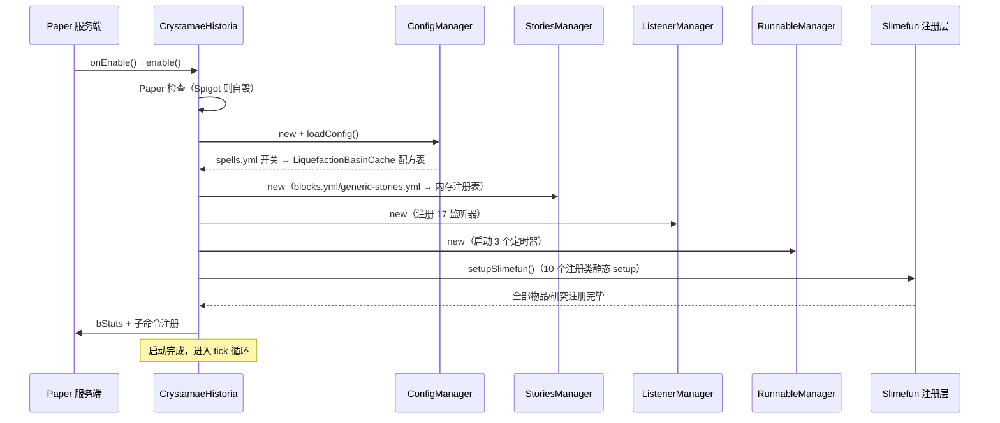
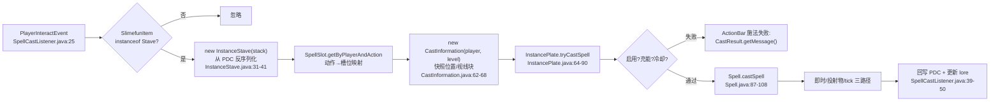
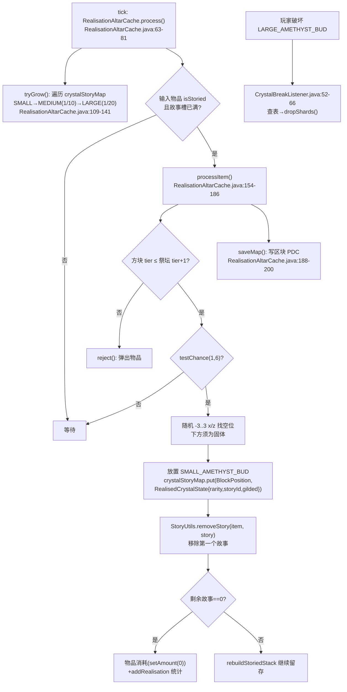
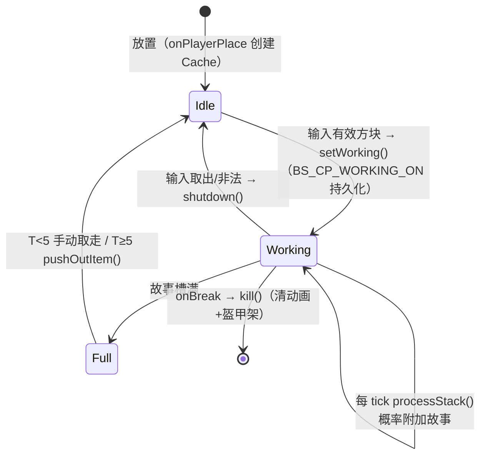
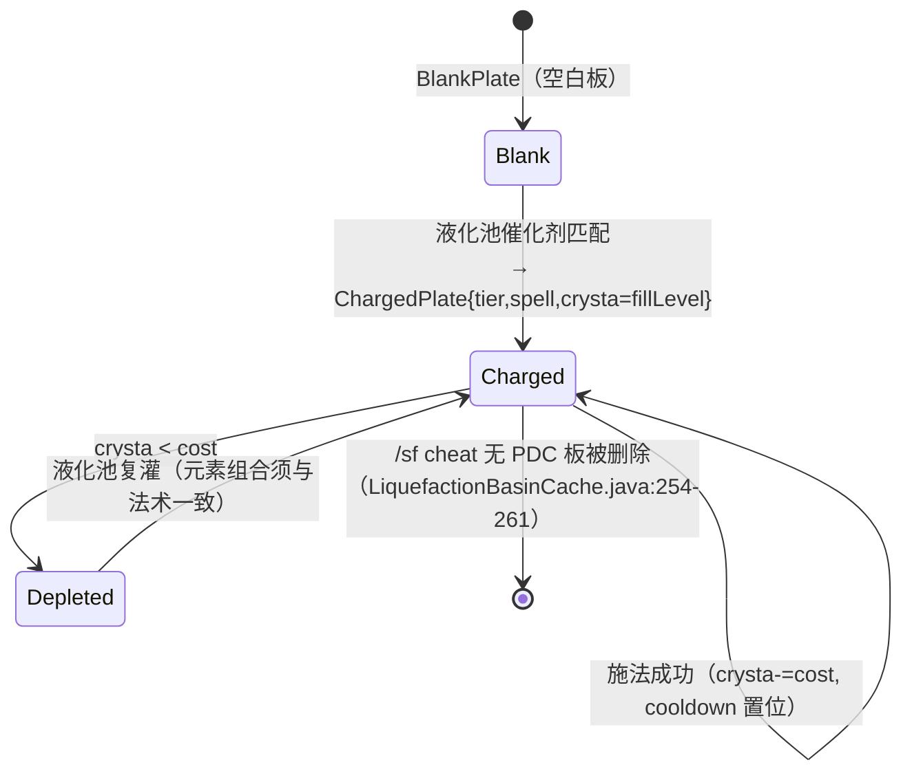

# CrystamaeHistoria（魔法水晶编年史）— 项目运行原理报告

**分析时间**：2026-08-15_011442
**分析范围**：`/f/Github/repo/CrystamaeHistoria-1.21.11`

---

## 1. 启动初始化序列

### 入口文件
**路径**：`src/main/java/io/github/sefiraat/crystamaehistoria/CrystamaeHistoria.java`
**角色**：Bukkit/Paper 插件主类，继承 InfinityLib `AbstractAddon`（其 `onEnable()/onDisable()` 桥接到本类的 `enable()/disable()` 模板方法）
**plugin.yml 声明**：`main: io.github.sefiraat.crystamaehistoria.CrystamaeHistoria`，`api-version: 1.17`，`depend: [Slimefun, GuizhanLibPlugin]`

### 初始化步骤

| 步骤 | 操作 | 代码位置 | 说明 |
|------|------|---------|------|
| 0 | 构造函数注册更新器参数 | `CrystamaeHistoria.java:61-63` | `super("SlimefunGuguProject", "CrystamaeHistoria", "master", "auto-update")` 交由 InfinityLib/GuizhanLib 处理自动更新 |
| 1 | 设置静态单例 | `CrystamaeHistoria.java:156` | `instance = this` |
| 2 | **服务端检查**（失败即自毁） | `CrystamaeHistoria.java:163-175` | `PaperLib.isSpigot() && !PaperLib.isPaper()` → 打印中文警告 → `disablePlugin(this)` 并 return |
| 3 | 自动更新启动 | `CrystamaeHistoria.java:177-179` | 条件：`config.yml#auto-update == true` 且版本号以 `Build` 开头 → `GuizhanUpdater.start(...)` |
| 4 | 实例化 7 个管理器 | `CrystamaeHistoria.java:181-187` | ConfigManager → StoriesManager → ListenerManager → RunnableManager → SpellMemory → SupportedPluginManager → EffectManager |
| 5 | 加载法术开关配置 | `CrystamaeHistoria.java:189` → `ConfigManager.loadConfig()` `ConfigManager.java:79-98` | 遍历 SpellType：spells.yml 缺项则写入 `true` 并保存；`spell.setEnabled()`；启用者将配方注册进 `LiquefactionBasinCache.addSpellRecipe()` |
| 6 | 固化启用法术数组 | `CrystamaeHistoria.java:191` → `SpellType.setupEnabledSpells()` `SpellType.java:181-185` | `enabledSpells = values().filter(isEnabled)` |
| 7 | 注册全部 Slimefun 物品 | `CrystamaeHistoria.java:193` → `setupSlimefun()` `CrystamaeHistoria.java:261-278` | ItemGroups → Materials → Mechanisms → Tools → Gadgets → ArtisticItems → Exalted → Uniques → Runes →（若 Netheopoiesis 在场）NetheoPlants，含 `NoClassDefFoundError` 兜底 |
| 8 | bStats 统计 | `CrystamaeHistoria.java:195` → `setupBstats()` `CrystamaeHistoria.java:204-246` | Metrics id=12065 + 3 个 AdvancedPie 自定义图表 |
| 9 | 注册 5 个子命令 | `CrystamaeHistoria.java:197-201` | TestSpell、TestWand、OpenSpellCompendium、OpenStoryCompendium、GetRanks |

### 管理器构造细节（步骤 4 展开）

| 管理器 | 构造时行为 | 代码位置 |
|--------|-----------|---------|
| `ConfigManager` | 加载 5 个 YAML：blocks.yml（带默认值合并）、generic-stories.yml（带默认值合并）、player_stats.yml、block_colors.yml、spells.yml | `ConfigManager.java:30-36`；合并逻辑 `getConfig()/updateConfig()` `ConfigManager.java:40-72` |
| `StoriesManager` | `fillBlockTierMap()` 硬编码 5 个方块层级 → `fillStories()` 从 generic-stories.yml 读 5 个稀有度池 → `fillBlockDefinitions()` 从 blocks.yml 读全部方块定义（逐条校验 name/material/section，非法则日志跳过） | `StoriesManager.java:50-227` |
| `ListenerManager` | 注册 17 个监听器（顺序见 `ListenerManager.java:26-42`） | `ListenerManager.java:45-47` 经 `PluginManager.registerEvents` |
| `RunnableManager` | 3 个定时任务：`TemporaryEffectsRunnable`（周期 20 tick=1s）、`SaveConfigRunnable`（周期 12000 tick=10min）、`ParticleDisplayRunnable`（周期 80 tick=4s） | `RunnableManager.java:18-29` |
| `SpellMemory` | 初始化 13 个空 HashMap（见 §3） | `SpellMemory.java:27-52` |
| `SupportedPluginManager` | 探测 softdepend 插件是否在场（mcMMO/ExoticGarden/Networks/WildStacker/RoseStacker/Netheopoiesis 等）并提供堆叠 API 适配 | `managers/SupportedPluginManager.java` |
| `EffectManager` | EffectLib 粒子引擎实例 | `CrystamaeHistoria.java:187` |

### 启动时序图

### 优雅关闭机制（`disable()`，`CrystamaeHistoria.java:248-259`）

1. 遍历 `ChroniclerPanel.getCaches()` 逐个 `cache.shutdown()`（停止动画、清除 LIGHT 方块）
2. `spellMemory.clearAll()`（`SpellMemory.java:54-105`）：取消全部法术 ticker → 清除投射物/掉落方块/召唤物/临时方块 → 取消玩家飞行 → 重置个人时间/天气 → 解除末影人抑制 → 恢复刷怪 → 移除展示物品 → 移除睡袋
3. `configManager.saveAll()`（`ConfigManager.java:100-113`）：保存 config.yml + player_stats.yml
4. `instance = null`

---

## 2. 核心数据流追踪

### 数据流 1：法术施放（玩家交互 → 效果结算）

**触发方式**：玩家手持法杖点击（`PlayerInteractEvent`）

**变量级数据变换详情：`InstancePlate.tryCastSpell()`（`InstancePlate.java:64-90`）**

| 步骤 | 变量名 | 类型 | 值/状态变化 | 代码位置 |
|------|--------|------|------------|---------|
| 函数入口 | `castInformation` | `CastInformation` | `{caster:UUID, staveLevel:int, castLocation:Location}` | InstancePlate.java:64 |
| 取法术 | `spell` | `Spell` | `storedSpell.getSpell()`（枚举持有实例） | InstancePlate.java:65 |
| 计算消耗 | `crystaCost` | `int` | `spellCore.crystaCost ×（staveLevel 若 crystaMultiplied）` | InstancePlate.java:66 → Spell.java:141-143 |
| 校验 1 | — | — | `ConfigManager.spellEnabled(spell) == false` → 返回 `SPELL_DISABLED` | InstancePlate.java:69 |
| 校验 2 | `crysta` | `int` | `crysta < crystaCost` → 返回 `CAST_FAIL_NO_CRYSTA` | InstancePlate.java:74 |
| 校验 3 | `cooldown` | `long` | `cooldown > System.currentTimeMillis()` → 返回 `ON_COOLDOWN` | InstancePlate.java:79 |
| 注入法术类型 | `castInformation.spellType` | `SpellType` | 由 null → 当前枚举 | InstancePlate.java:83 |
| 执行 | — | — | `spell.castSpell(castInformation)` 副作用发生在 Consumer 回调内 | InstancePlate.java:84 |
| 扣充能 | `this.crysta` | `int` | `crysta - crystaCost`（可能为负？不会：校验 2 保证 ≥） | InstancePlate.java:85 |
| 设冷却 | `this.cooldown` | `long` | `now + cooldownSeconds×1000`（若 cooldownDivided 则除以法杖等级） | InstancePlate.java:86-87 → Spell.java:131-133 |
| 统计 | — | — | `PlayerStatistics.addUsage(caster, storedSpell)`（player_stats.yml 计数 +1） | InstancePlate.java:88 → PlayerStatistics.java:45 |
| 返回 | — | `CastResult` | `CAST_SUCCESS` | InstancePlate.java:89 |

**数据格式变化点**：`ItemStack PDC 字节` → `Map<SpellSlot, InstancePlate>`（`PersistentStaveDataType` 反序列化）→ 运行时对象 → 施法后**再序列化回 PDC**（`SpellCastListener.java:39-46`）。时间复杂度：反序列化 O(槽位数)=O(1)；PDC 回写每次施法一次。

**副作用清单**：扣充能、设冷却、统计计数、可能的世界效果（由具体法术 Consumer 产生）、ActionBar 消息、lore 重建。

### 数据流 2：故事发掘（记录者面板）

**触发方式**：Slimefun tick 调度 `ChroniclerPanel.tick()`（`ChroniclerPanel.java:99`），同步执行（`synchronous() == true`）

**变量级数据变换详情：`ChroniclerPanelCache.processStack()`（`ChroniclerPanelCache.java:235-258`）**

| 步骤 | 变量名 | 类型 | 值/状态变化 | 代码位置 |
|------|--------|------|------------|---------|
| 入口 | `i` | `ItemStack` | 输入槽中的普通方块（如 STONE，amount=1） | ChroniclerPanelCache.java:235 |
| 读剩余槽 | `remaining` | `int` | `getMaxStoryAmount - getStoryAmount`（PDC JSON `JS_S_AS` - PDC int `s_cur_n`） | ChroniclerPanelCache.java:239 → StoryUtils.java:181-183 |
| 概率判定 | `req` | `int` | `blockDefinition.blockTier.chroniclingChance`（万分比，T1 石头=700 即 7%/tick） | ChroniclerPanelCache.java:240 → StoriesManager.java:57-72 |
| 抽稀有度 | `rnd` | `int` | `1..100`，对照 StoryChances 累积阈值 | StoryUtils.java:212-224 |
| 选故事 | `story` | `Story` | 在 (方块 elements ∩ 稀有度池) 内随机 | StoryUtils.java:228-237 |
| 写 PDC | `storyList` | `List<Story>` | 追加并序列化进 `PDC_STORIES` | StoryUtils.java:240-249 |
| 计数 | `s_cur_n` | `int` | +1；若达上限 → 附魔发光（LUCK 1 + HIDE_ENCHANTS） | StoryUtils.java:257-259, 274-282 |
| 最终故事 | — | — | `requestUniqueStory()`：追加方块专属 UNIQUE 故事 | StoryUtils.java:285-290 |
| 玩家统计 | — | — | `unlockUniqueStory` + `addChronicle`（记入 activePlayer） | ChroniclerPanelCache.java:247-252 |
| lore 重建 | `i` lore | `List<String>` | "有故事的X" + 每个故事的显示名与文本行 | StoriesManager.java:240-260 |

**边界条件**：
- 带 ItemMeta 的物品默认不可故事化，例外白名单 18 种（`StoryUtils.java:52-72`）；Slimefun 物品仅刷怪笼例外（`StoryUtils.java:76-81`）
- 面板 tier 限制：`canBeStoried(item, tier + 1)`——T1 面板可处理 tier ≤2 方块（`ChroniclerPanelCache.java:123`）
- 输入堆叠 >1 时弹出多余部分（`rejectOverage`，`ChroniclerPanelCache.java:197-205`）
- T5+ 面板自动吸取 0.3 格内掉落物 / 自动弹出成品（`ChroniclerPanelCache.java:116-121, 135-140`）

### 数据流 3：现实祭坛提取水晶（有故事物品 → 水晶芽 → 碎片）

**状态持久化**：`crystalStoryMap` 通过 `PersistentStoryChunkDataType` 序列化到**区块 PDC**，键为祭坛位置的 `BlockPosition` 字符串（`RealisationAltarCache.java:199`）；区块重新加载时由 `onNewInstance → loadMap()` 恢复（`RealisationAltar.java:99-106`、`RealisationAltarCache.java:230-246`）。

### 数据流 4：液化池合成（水晶 → 液化魔法 → 法术板/物品）

**触发方式**：`LiquefactionBasin` tick → `LiquefactionBasinCache.consumeItems()`（`LiquefactionBasinCache.java:87-116`）吸取 0.3 格内掉落物。

**变量级数据变换：`processBlankPlate()`（`LiquefactionBasinCache.java:214-243`）**

| 步骤 | 变量名 | 类型 | 值/状态变化 | 代码位置 |
|------|--------|------|------------|---------|
| 入口 | `contentMap` | `EnumMap<StoryType,Integer>` | 池内 9 种元素各自的液化量 | LiquefactionBasinCache.java:65 |
| 取前三 | `set` | `Set<StoryType>` | 按含量降序取前 3 种元素 | LiquefactionBasinCache.java:215-219 |
| 匹配 | `spellType` | `SpellType?` | `getMatchingRecipe(set, plate)`：遍历 RECIPES_SPELL，`recipeMatches(set, tier)` | LiquefactionBasinCache.java:224, 362-371 |
| 产出 | — | `ItemStack` | `ChargedPlate.getChargedPlate(tier, spellType, fillLevel)`（充能量=当前总液位） | LiquefactionBasinCache.java:226 |
| 统计 | — | — | `PlayerStatistics.unlockSpell(activePlayer, spellType)` | LiquefactionBasinCache.java:233-237 |
| 清空 | `contentMap` | — | `emptyBasin()`：清空+清 BlockStorage+重置展示 | LiquefactionBasinCache.java:239, 177-183 |

**充能复灌**：`processChargedPlate()`（`LiquefactionBasinCache.java:245-283`）要求池内前三元素组合与法术板已存法术一致，才 `instancePlate.addCrysta(fillLevel)` 并回写 PDC；`/sf cheat` 得到的无 PDC 板会被警告并删除（`LiquefactionBasinCache.java:254-261`）。

**一般物品合成**：`processOtherItem()`（`LiquefactionBasinCache.java:286-348`）按 (元素序列+数量序列+催化剂物品) 匹配 `RECIPES_ITEMS`；背包（CrystamageSatchel）合成时迁移旧 PDC 实例并升级 tier（`LiquefactionBasinCache.java:307-333`）。

**配方注册来源**：法术配方在 `ConfigManager.loadConfig()` 阶段由每个 `Spell.getRecipe()` 提供（`ConfigManager.java:95`）；物品配方在各注册类中调用 `LiquefactionBasinCache.addCraftingRecipe()`（`LiquefactionBasinCache.java:82-84`）。

---

## 3. 状态管理与持久化分析

### 应用状态：`SpellMemory` 13 张运行时映射表（`SpellMemory.java:27-52`）

| 映射表 | 键 → 值 | 过期语义 |
|--------|---------|---------|
| `projectileMap` | `MagicProjectile → Pair<CastInformation, Long expiry>` | `removeProjectiles()` 按毫秒时间戳清除并 `kill()` |
| `fallingBlockMap` | `MagicFallingBlock → Pair<CastInformation, Long>` | 同上 |
| `strikeMap` | `UUID(闪电) → Pair<CastInformation, Long>` | 1 秒过期（`Spell.java:209`） |
| `tickingCastables` | `SpellTickRunnable → Integer tickAmount` | ticker 自行 cancel |
| `blocksToRemove` | `BlockPosition → Long deadline` | `removeBlocks()` 设 AIR |
| `summonedEntities` | `MagicSummon → Long expiry` | `removeEntities()`：过期或生物死亡则 kill，否则 `run()`（tick 回调） |
| `playersWithFlight` | `UUID → Long` | 到期关闭玩家飞行 |
| `playersWithFrozenTime` / `playersWithFrozenWeather` | `UUID → Long` | 到期 `resetPlayerTime/Weather` |
| `inhibitedEndermen` | `UUID → Long` | 末影人传送抑制名单（`EndermanInhibitorListener.java:14-21`） |
| `noSpawningAreas` | `BoundingBox → Long` | 怪物生成禁止区（`MobCandleListener.java:14-30`） |
| `displayItems` | `DisplayItem → Long` | 展示物品到期清除 |
| `sleepingBags` | `UUID → Location` | 睡袋位置（离床/关闭时还原 AIR，`MiscListener.java:104-112`） |

**清理驱动**：`TemporaryEffectsRunnable` 每 20 tick（1s）调用各 `removeXxx(false)`（`RunnableManager.java:21-22`）；插件关闭时 `clearAll()` 强制全部清理。

### 机械状态：`static CACHES` 注册表 + BlockStorage

每个机械方块以 `Map<Location, *Cache>` 保存实例状态；跨重启持久化依赖两条通道：
1. **Slimefun BlockStorage**（字符串键值）：如 `BS_CP_WORKING_ON`、`BS_CP_ACTIVE_PLAYER`、液化池液位 `ch_c_lvl:<StoryType>`（`LiquefactionBasinCache.java:60, 207-211`）
2. **区块/物品 PDC**：现实祭坛水晶图（区块 PDC，`RealisationAltarCache.java:188-200`）；法术板/法杖/背包实例（物品 PDC）

### 玩家状态：player_stats.yml

`PlayerStatistics` 以静态方法读写 `ConfigManager.getPlayerStats()` FileConfiguration（`player/PlayerStatistics.java`），键格式按 UUID 分节：法术解锁/使用次数、方块故事解锁/记录次数/现实化次数、镀金解锁。`SaveConfigRunnable` 每 12000 tick（10 分钟）落盘一次（`RunnableManager.java:24-25`），插件关闭时 `saveAll()` 再落盘（`ConfigManager.java:100-113`）。**风险**：服务器崩溃可能丢失最近 10 分钟统计。

### 状态机提取

#### 状态机 1：记录者面板工作状态

| 当前状态 | 目标状态 | 触发操作 | 条件 | 代码位置 |
|---------|---------|---------|------|---------|
| Idle | Working | `setWorking()` | 输入物 `canBeStoried(item, tier+1)` | `ChroniclerPanelCache.java:66-79, 123, 145-148` |
| Working | Working | `processStack()` | `workingOn == inputItemType` | `ChroniclerPanelCache.java:149-153` |
| Working | Idle | `shutdown()/setNotWorking()` | 输入为空或非法 | `ChroniclerPanelCache.java:123-126, 190-195, 216-232` |
| Working | Full→Idle | `pushOutItem()` | `!hasRemainingStorySlots && tier ≥ 5` | `ChroniclerPanelCache.java:135-140` |
| 任意 | 销毁 | `kill()` | 方块被破坏 | `ChroniclerPanel.java:89-95`、`ChroniclerPanelCache.java:286-289` |

**非法转换防护**：无显式状态枚举，靠布尔 `working` + `workingOn` 组合隐式表达；重启后由构造器从 BlockStorage 恢复 working 状态（`ChroniclerPanelCache.java:54-57`）。

#### 状态机 2：现实化水晶生长（`tryGrow()`，`RealisationAltarCache.java:109-141`）

| 当前状态 | 目标状态 | 触发 | 概率 | 代码位置 |
|---------|---------|------|------|---------|
| SMALL_AMETHYST_BUD | MEDIUM_AMETHYST_BUD | tick | 1/10 | `RealisationAltarCache.java:122-127` |
| MEDIUM_AMETHYST_BUD | LARGE_AMETHYST_BUD | tick | 1/20 | `RealisationAltarCache.java:128-133` |
| LARGE_AMETHYST_BUD | （收获态） | 玩家破坏 | — | `CrystalBreakListener.java:23-30` |
| 任意 | （从映射移除） | 方块被外力改变（default 分支） | — | `RealisationAltarCache.java:137-138` |

#### 状态机 3：法术板实例（`InstancePlate`，`InstancePlate.java:22-99`）

### 生命周期钩子（Bukkit/Slimefun 调度顺序）

| 钩子类型 | 注册顺序 | 处理逻辑 | 代码位置 |
|---------|---------|---------|---------|
| `BlockPlaceHandler`（机械放置） | 每机械 `preRegister()` | 创建 Cache、记录 activePlayer | `ChroniclerPanel.java:43-58` |
| `TickingMenuBlock.tick()` | Slimefun 全局 tick 循环（同步） | 委派 `cache.process()/consumeItems()` | `ChroniclerPanel.java:99-104` |
| `onNewInstance()` | BlockMenu 重新打开/区块加载 | 恢复 Cache（含 loadMap） | `RealisationAltar.java:99-106` |
| `onBreak()` | 方块破坏事件 | `CACHES.remove + kill()`、掉落输入槽物品 | `RealisationAltar.java:110-118` |
| `PlayerInteractEvent`（LOWEST） | MiscListener 冷却拦截 | `GeneralUtils.isOnCooldown` 则取消 | `MiscListener.java:92-102` |
| `PlayerInteractEvent`（LOW） | RefractingLensListener | 折射透镜读取机械内容 | `RefractingLensListener.java:36-56` |
| `PlayerInteractEvent`（NORMAL） | SpellCastListener | 法杖施法 | `SpellCastListener.java:24-57` |

---

## 4. 数据持久化分析

**无传统数据库**，持久化分四通道：

| 通道 | 内容 | 位置/格式 |
|------|------|----------|
| YAML 文件 | blocks/generic-stories（只读数据，带默认值合并）；player_stats/spells（运行时写） | `plugins/CrystamaeHistoria/*.yml`，经 `ConfigManager.getConfig()` `ConfigManager.java:40-62` |
| Slimefun BlockStorage | 机械方块键值状态 | `data-storage/` Slimefun 管理 |
| Bukkit PDC（物品/实体/区块） | 故事列表、法术板、法杖、背包、水晶图、刷怪笼主人等 | `utils/datatypes/` 8 个自定义 `PersistentDataType` + `DataTypeMethods` 门面 |
| Slimefun 研究系统 | 玩家解锁进度 | Slimefun 管理 |

**迁移策略**：无版本化迁移；blocks.yml/generic-stories.yml 通过 `updateConfig()` 的 `copyDefaults(true)` 增量补全缺失键（`ConfigManager.java:64-72`）——**不覆盖用户已改值**，也不删除废弃键。

---

## 5. 错误处理体系

### 错误类型层次

项目**无自定义异常类**。错误表达依赖：
1. **枚举结果**：`CastResult`（5 值，中文消息，`CastResult.java:5-10`）——施法链唯一错误通道
2. **前置条件断言**：`Preconditions.checkNotNull/checkArgument`（Guava）用于"不应发生"的内部错误：
   - `CastInformation is null, magical projectile spawned incorrectly.`（`CrystamaeHistoria.java:125-128`）
   - `The selected material does not have a story definition. This shouldn't happen, SefiDumb™`（`StoryUtils.java:149-152`）
   - `Chances must add up to 100 for a StoryChance`（`StoryChances.java:17-18`）
   - generic-stories.yml 五个池缺失 → `Preconditions.checkNotNull` 直接使插件启动失败（`StoriesManager.java:142-160`）
3. **静默降级**：`e.printStackTrace()`（`ConfigManager.java:50, 59, 89, 111`）——配置 IO 失败不中断启动

### 关键异常处理点

| 场景 | 处理方式 | 代码位置 |
|------|---------|---------|
| Spigot 而非 Paper | 中文警告 + `disablePlugin(this)` 自毁 | `CrystamaeHistoria.java:163-175` |
| Netheopoiesis 版本过旧（`NoClassDefFoundError`） | catch 并 severe 日志，跳过下界植物注册 | `CrystamaeHistoria.java:271-277` |
| blocks.yml 方块定义缺 section/name/material | 逐条日志跳过，继续加载其余 | `StoriesManager.java:168-199` |
| 非法物品进面板 | `reject()` 弹出 + shutdown | `ChroniclerPanelCache.java:123-126` |
| 液化池液位溢出 | `rejectItem()` 给予随机速度弹出 | `LiquefactionBasinCache.java:118-123, 129-130` |
| `/sf cheat` 无 PDC 充能板 | warning 日志 + 删除物品 | `LiquefactionBasinCache.java:254-261` |
| 施法三态失败 | ActionBar 中文提示（充能不足/冷却中/已禁用/空槽位） | `SpellCastListener.java:51-55` |

**缺失分支标记（潜在缺陷）**：
- `ChroniclerPanel.onBreak()` 未判空：`CACHES.remove()` 返回 null 时 `chroniclerPanelCache.kill()` 会 NPE（`ChroniclerPanel.java:92-93`），而 `RealisationAltar.onBreak()` 有判空（`RealisationAltar.java:113-116`）——两机械实现不一致
- `SpellMemory.removeEntities()` 对 `summonedEntities.get(magicSummon)` 返回 null 无防护（`SpellMemory.java:130`）
- 配置文件 IO 全部 `printStackTrace` 无用户可见告警（`ConfigManager.java:50,59,89,111`）

### 重试策略
无重试/熔断机制（单进程游戏插件，失败即放弃或弹出物品）。

---

## 6. 并发与异步处理

- **并发模型**：单线程（Bukkit 主线程）。机械 tick 全部 `synchronous() == true`（`ChroniclerPanel.java:106-109`、`RealisationAltar.java:75-78`）
- **定时任务**：`RunnableManager` 三个 `runTaskTimer`（1/20/12000/80 tick 周期）+ 每法术独立 `SpellTickRunnable`
- **EffectLib** 内部管理自己的特效调度（仍基于 Bukkit scheduler）
- **竞态处理**：依赖主线程单线程假设；`SpellMemory` 各 Map 为普通 `HashMap`（`SpellMemory.java:28-52`），若未来引入异步 tick 将有竞态风险
