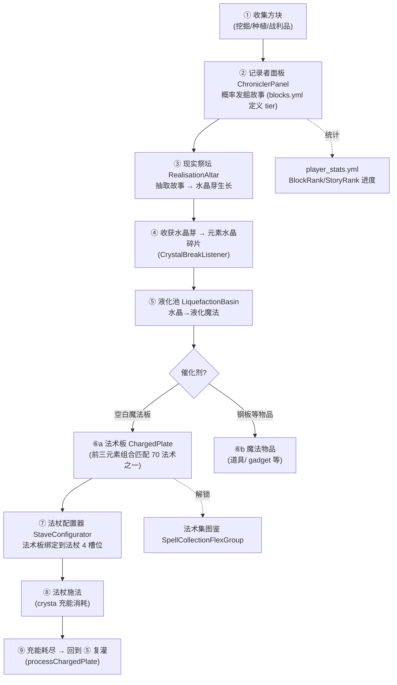
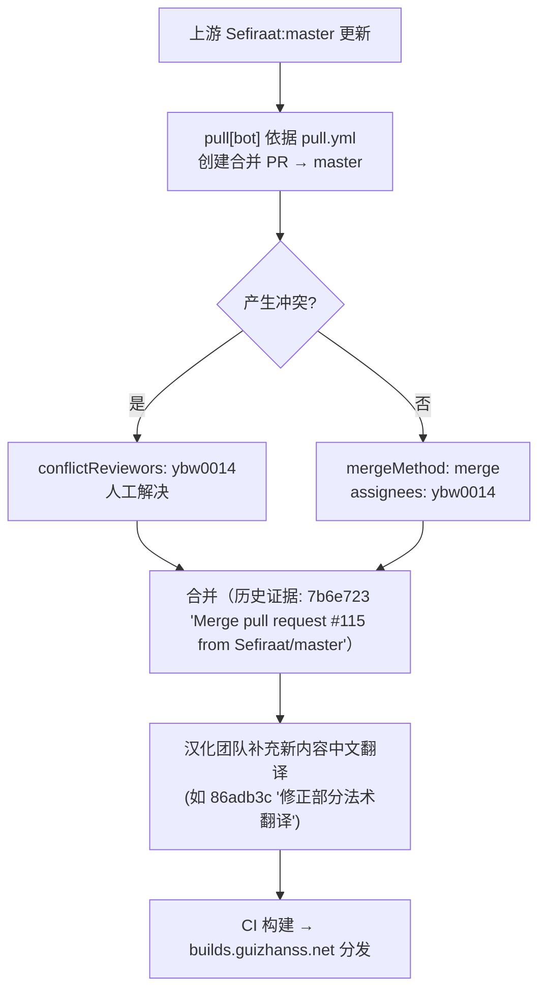

# CrystamaeHistoria（魔法水晶编年史）— 项目工作流分析报告

**分析时间**：2026-08-15_011442
**分析范围**：`/f/Github/repo/CrystamaeHistoria-1.21.11`

---

## 1. CI/CD 管线

**状态**：已配置（仅构建，无测试、无部署）

### 管线概览
- **CI 工具**：GitHub Actions
- **配置文件**：`.github/workflows/maven.yml`
- **触发条件**：
  - `push` → `master`（`.github/workflows/maven.yml:3-5`）
  - `pull_request` → `master`（`.github/workflows/maven.yml:6-8`）
  - 跳过机制：提交信息以 `[CI skip]` 开头则不运行（`.github/workflows/maven.yml:11`，历史中有 `[CI Skip]` 大小写混用，如提交 `addfd63`、`b45b5a4`）

### 管线阶段

```mermaid
flowchart LR
    A[push/PR → master] --> B{head_commit 以 [CI skip 开头?}
    B -->|是| Z[跳过]
    B -->|否| C[actions/checkout@v4]
    C --> D["actions/setup-java@v4<br>temurin, java-version=vars.BUILDS_JAVA_VERSION<br>maven 缓存"]
    D --> E["mvn package --file pom.xml"]
    E --> F["产物: target/CrystamaeHistoria-*.jar<br>(shade  Fat Jar)"]
```

| 阶段 | 运行内容 | 配置位置 |
|------|---------|---------|
| Checkout | `actions/checkout@v4` | `.github/workflows/maven.yml:14-15` |
| JDK | temurin，版本取自仓库变量 `vars.BUILDS_JAVA_VERSION` | `.github/workflows/maven.yml:17-22` |
| 构建 | `mvn package`（shade 打包含 InfinityLib/EffectLib/bStats 的 fat jar） | `.github/workflows/maven.yml:24-25` |

### 部署策略

- **无显式部署阶段**。发布经由外部构建服务：README 徽章指向 `https://builds.guizhanss.net/SlimefunGuguProject/CrystamaeHistoria/master`（[构建站](https://builds.guizhanss.net/SlimefunGuguProject/CrystamaeHistoria/master)，README.md:12,18-19）——master 分支构建成功后由该站提供下载，插件内 `GuizhanUpdater`（`CrystamaeHistoria.java:177-179`）实现客户端自动更新
- **回滚机制**：无（构建站保留历史构建号，用户可手动下载旧版 jar）

---

## 2. 测试策略

### 测试全景

| 测试类型 | 框架 | 文件数 | 位置 | 覆盖目标 |
|---------|------|--------|------|---------|
| 单元测试 | — | **0** | — | 无 |
| 集成测试 | — | **0** | — | 无 |
| E2E 测试 | — | **0** | — | 无 |
| 人工验证命令 | 插件内命令 | 2 | `commands/TestSpell.java`、`commands/TestWand.java` | 开发者在游戏内手动测试法术/法杖 |

### 测试健康度

| 维度 | 评估 | 证据 |
|------|------|------|
| 覆盖率 | **零自动化测试** | 全仓库无 `src/test/`，无 JUnit/TestNG 依赖（`pom.xml:116-231` 依赖列表） |
| CI 集成 | CI 仅 `mvn package`，构建通过 ≠ 行为正确 | `.github/workflows/maven.yml:24-25` |
| 质量保障替代手段 | 人工游戏内测试（TestSpell/TestWand 命令）+ 生产环境 issue 反馈（issue #121、#122 即 1.21 兼容 bug，提交 `f0b0223`、`d52f0e4`） | `git log` |

**结论**：测试完全依赖"生产环境发现 + issue 修复"的被动模式。这对 Minecraft 插件生态常见（依赖运行时 API 难以离线测试），但本项目连纯逻辑（如 `StoryChances` 概率累积、`RecipeSpell.recipeMatches` 集合匹配）都没有测试，属可改进空间最大的环节。

---

## 3. 核心业务流程映射

项目的"业务"即玩家魔法进度循环与开发者维护循环。

### 流程 1：玩家魔法进度主循环（核心游戏循环）

**涉及模块**：`slimefun/items/mechanisms/chroniclerpanel/`、`realisationaltar/`、`liquefactionbasin/`、`staveconfigurator/`、`magic/`、`player/PlayerStatistics`
**触发条件**：玩家放置记录者面板并开始投入方块
**参与角色**：玩家、机械方块（自动 tick）、Slimefun 研究系统



**关键代码路径**：
1. `ChroniclerPanelCache.process()` — `ChroniclerPanelCache.java:111-154`
2. `RealisationAltarCache.processItem()` — `RealisationAltarCache.java:154-186`
3. `CrystalBreakListener.handleCrystal()` — `CrystalBreakListener.java:52-66`
4. `LiquefactionBasinCache.processBlankPlate()` — `LiquefactionBasinCache.java:214-243`
5. `InstanceStave.tryCastSpell()` — `InstanceStave.java:78-85`

### 流程 2：法术施放与结算

**涉及模块**：`listeners/SpellCastListener`、`magic/spells/core/`、`magic/spells/tier1/`（70 法术）、`SpellMemory`、`SpellEffectListener`
**触发条件**：玩家持法杖点击

**决策树：施法请求处理**（条件链 `SpellCastListener.java:25` → `InstancePlate.java:64-90`）：

```
条件链：
├── 条件1: 主手物品是 Slimefun 物品且 instanceof Stave? (SpellCastListener.java:28-29)
│   ├── 否 → 忽略事件
│   └── 是 → 条件2: 点击动作能映射到 SpellSlot?（左键/右键×是否潜行 = 4 槽位）(SpellCastListener.java:32-35)
│       ├── 否 → return
│       └── 是 → 条件3: 该槽位绑定了法术板? (InstanceStave.java:79-84)
│           ├── 否 → CAST_FAIL_SLOT_EMPTY「该栏位没有法术」
│           └── 条件4: spells.yml 中该法术启用? (InstancePlate.java:69-71)
│               ├── 否 → SPELL_DISABLED「该法术已被禁用」
│               └── 条件5: 法术板充能 ≥ 消耗? (InstancePlate.java:74-76)
│                   ├── 否 → CAST_FAIL_NO_CRYSTA「充能不足」
│                   └── 条件6: 冷却已过? (InstancePlate.java:79-81)
│                       ├── 否 → ON_COOLDOWN「法术冷却中」
│                       └── 执行 castSpell → CAST_SUCCESS「释放法术: <名称>」
```

**业务规则量化**：
- 法杖最多 4 个法术槽位（左键、右键、Shift+左键、Shift+右键，README.md:65）
- 法术数值随法杖等级缩放：`rangeMultiplied/damageMultiplied/...` 各标志决定是否 `× staveLevel`（`Spell.java:131-168`）
- 冷却可被法杖等级除：`cooldownDivided`（`Spell.java:131-133`）
- 物品冷却：`GeneralUtils.putOnCooldown(itemStack, seconds)` 以 PDC `PDC_ON_COOLDOWN` 存储（`GeneralUtils.java:283-309`、`Keys.java:48`）

### 流程 3：上游同步与汉化维护（开发者流程）

**涉及模块**：`.github/pull.yml`、`.github/CODEOWNERS`、`pom.xml` 依赖声明、`resources/` 中文文本
**触发条件**：上游 Sefiraat/CrystamaeHistoria 有新提交
**参与角色**：`pull[bot]`、维护者 `ybw0014`、code-reviewers 团队



证据：`.github/pull.yml:2-9`（`base: master, upstream: Sefiraat:master, mergeMethod: merge`）；`CODEOWNERS:1`（`*.java → @SlimefunGuguProject/code-reviewers`）；git 历史 127 个 `Merge pull request` 提交、58 个 Renovate 依赖更新提交。

### 流程 4：Minecraft 版本兼容适配（本 fork 的核心活动）

**涉及模块**：`pom.xml`（API 版本）、受 API 变更影响的代码点
**触发条件**：目标服务端版本升级（1.19 → 1.20.6 → 1.21 → 1.21.11）

**决策树（从 git 历史归纳）**：
```
├── 条件1: Paper/MC API 签名变更?
│   ├── 是 → 定位编译/运行报错点
│   │   ├── 包名变更 → 改 import（f0b0223: GuizhanLib 新包名 net.guizhanss.minecraft.guizhanlib，4 文件 import 修正）
│   │   ├── 行为变更 → 改逻辑（d52f0e4: 法术集 SpellCollectionFlexGroup 在 1.21 报错，2 行修正）
│   │   └── 仓库地址失效 → 改 pom（3d05b93: papermc 仓库 URL 迁移 repo.papermc.io）
│   └── 条件2: 依赖插件 API 变更?（Slimefun/GuizhanLib）
│       └── 升级依赖版本（72ce827/7062a84 '更新依赖'; f2e9dd9 '更新 EffectLib'）
```

**异常恢复路径（版本适配）**：

| 流程步骤 | 可能失败点 | 处理方式 | 恢复策略 | 证据 |
|---------|-----------|---------|---------|------|
| 依赖解析 | 仓库 URL 失效 | CI 构建失败 | 人工修正 repository URL | 提交 `3d05b93` |
| 运行时类缺失 | Netheopoiesis 旧版 | catch `NoClassDefFoundError` + severe 日志，跳过功能 | 提示用户更新前置 | `CrystamaeHistoria.java:271-277` |
| 玩家报告 bug | 1.21 法术集 GUI 崩溃 | issue #122 → 修复提交 | 快速补丁（同日两提交） | 提交 `d52f0e4` |
| 包名迁移 | GuizhanLib 2.x 新包名 | issue #121 → 批量 import 替换 | 无自动化，纯手工 | 提交 `f0b0223` |

---

## 4. 开发工作流

### 分支策略
- **主分支**：`master`（无 develop/release 分支；git 仅见 `master` 与一个遗留远端分支 `fix/1-20-6`）
- **上游同步**：`pull[bot]` 自动 PR（`.github/pull.yml`）
- **临时修复分支**：历史上使用过 `fix/1-20-6`（1.20.6 兼容，提交 `4dc4783`，后被 revert 再重做，见 `74f05dd revert: 4dc47834`）——表明曾有一次失败的兼容尝试被回滚
- **本地工作区**：当前在 `analysis/codebase-analyzer-2026-08-15` 分析分支（本次分析创建，避免污染 master）；本地 `.gitignore` 有一处未提交改动（新增 `/REF`，为本地参考目录排除项，非本次分析产生，未纳入任何提交）

### 版本管理
- **无语义化版本**：`pom.xml:8` 为 `MODIFIED`，实际版本由 CI 构建号注入（`Build #N`）
- CONTRIBUTING.md:10 提及 SemVer 约定，但与实际做法不符（文档债务）

### 依赖自动化
- **Renovate Bot**：自动依赖升级（历史 58 个相关提交，如 mcMMO `2.1.211→2.1.212→2.1.217`）
- **风险点**：依赖多为 `provided` 且版本钉在快照/commit hash（如 ExoticGarden `edae221160`、Networks `3de3c9d608`，`pom.xml:170,188`），上游强制推送可导致构建不可复现

### Issue/PR 流程
- Issue 模板：`bug-report.yml`（中文表单），`config.yml` 提供 QQ 群入口（`https://50l.cc/gugu-qgroup`，.github/ISSUE_TEMPLATE/config.yml:4-6）
- Code Review：CODEOWNERS 要求 code-reviewers 团队审阅全部 `.java` 变更
- 贡献指南：先经 Discord 讨论 → PR → 一名开发者 sign-off（CONTRIBUTING.md）

### 发布流程
1. 变更合并 `master`
2. GitHub Actions 构建 jar（`[CI skip]` 可跳过文档类提交）
3. builds.guizhanss.net 构建站拉取产物并编号
4. 线上服务器插件 `auto-update: true`（`config.yml:1`）自动拉取新构建（仅版本以 `Build` 开头时，`CrystamaeHistoria.java:177`）
