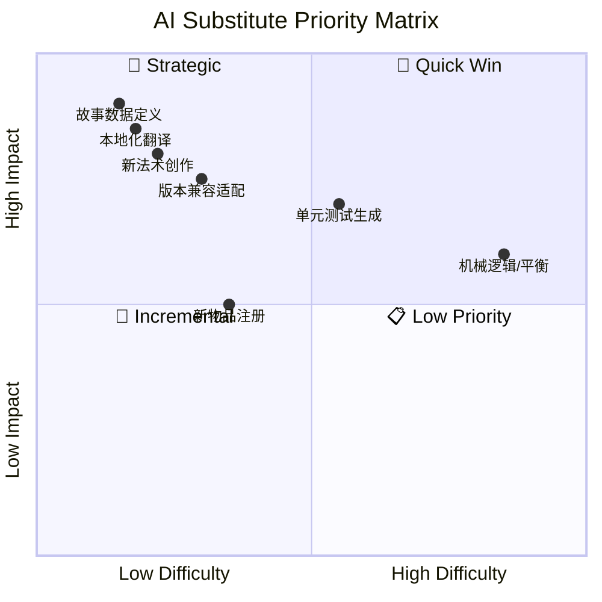

# CrystamaeHistoria（魔法水晶编年史）— AI 工作流替代方案报告

**分析时间**：2026-08-15_011442
**分析范围**：`/f/Github/repo/CrystamaeHistoria-1.21.11`

---

## 1. 评估方法论

### 评分维度（1-5 分，分数越高越适合 AI）

| 维度 | 说明 | 低分（1-2） | 高分（4-5） |
|------|------|------------|------------|
| 确定性 | 输出是否可预测 | 高度创造性 | 完全确定性 |
| 输入结构化 | 输入是否边界清晰 | 模糊开放 | 严格结构化 |
| 安全风险 | 出错影响 | 灾难性 | 无影响 |
| 领域复杂度 | 所需专业程度 | 需要专家 | 通用知识 |
| 上下文需求 | 处理所需信息量 | 需整个代码库 | 局部即可 |
| 重复性 | 任务发生频率 | 一次性 | 高频重复 |

### 分级标准
| 等级 | 总分 | 策略 |
|------|------|------|
| 🤖 完全 AI 化 | 24-30 | AI 直接执行，无需人工介入 |
| 🧑‍💻 AI 辅助 | 15-23 | AI 生成初稿，人工审核后落地 |
| 👤 人工主导 | 6-14 | AI 仅提供参考，核心判断由人完成 |

---

## 2. 模块级评估

### 模块 1：新法术创作（tier1 法术）

**路径**：`src/main/java/io/github/sefiraat/crystamaehistoria/magic/spells/tier1/`（70 个文件）+ `magic/SpellType.java` 注册行 + `slimefun/CrystaStacks.java` 物品描述
**规模**：70 个法术类，每个约 60-150 行，结构高度同构

**6 维评分**：

| 确定性 | 输入结构化 | 安全风险 | 领域复杂度 | 上下文需求 | 重复性 | 总分 |
|--------|-----------|---------|-----------|-----------|-------|------|
| 4 | 5 | 4 | 3 | 4 | 5 | **25/30** |

**结论**：🤖 **完全 AI 化**

**当前人工做法**：每个法术 = 1 个 `Spell` 子类（实现 `getId/getMaterial/getLore/getRecipe/getSpellCore`）+ `SpellType` 枚举追加 1 行 + CrystaStacks 描述 + 液化池配方（3 元素组合 × 板 tier）。70 个法术证明该模板已被重复执行 70 次。

**AI 替代方式**：给定"法术概念描述（效果/数值/元素组合/稀有材料）"，AI 按 SpellCoreBuilder 声明式 API 生成完整法术类；平衡性由数值表约束。

**实施难度**：低。**预期收益**：新法术开发时间减少 ~80%（模板代码全自动，人只审数值与创意）。**优先级**：⭐⭐⭐ 高

**函数级替代粒度（模板固定点）**：

| 函数 | 签名 | AI 替代潜力 |
|------|------|-----------|
| `getId()` | `String getId()` | 完全 AI 化（由类名推导） |
| `getMaterial()` | `Material getMaterial()` | 完全 AI 化（图标选择） |
| `getLore()` | `String[] getLore()` | 完全 AI 化（中文文案生成） |
| `getRecipe()` | `RecipeSpell getRecipe()` | 完全 AI 化（3 元素组合 + tier，需校验唯一性） |
| `getSpellCore()` | `SpellCore getSpellCore()` | AI 辅助（效果回调 Consumer 是唯一需要创意/判断处） |

**接口契约（getSpellCore 前置/后置条件）**：
- 前置：cooldownSeconds ≥ 0；若 `isProjectileSpell` 必须提供 `fireProjectileEvent`；tick 法术必须提供 `tickInterval > 0` 与 `numberOfTicks > 0`
- 后置：法术可通过 `SpellType` 枚举注册后被液化池配方系统发现（`ConfigManager.loadConfig()` 自动登记，`ConfigManager.java:79-98`）
- 错误场景：元素组合与既有 70 法术冲突 → 液化池 `getMatchingRecipe()` 仅返回首个匹配（`LiquefactionBasinCache.java:362-371`），造成"配方覆盖"缺陷

**风险与限制**：涉及世界修改（放火/召唤/方块操作）的法术 Consumer 需要人工审查服务器安全（爆炸、权限绕过）；数值平衡需人工试玩。

**对应 Blueprint**：[blueprints/01-spell-author.md](blueprints/01-spell-author.md)

---

### 模块 2：方块故事数据定义（blocks.yml / generic-stories.yml）

**路径**：`src/main/resources/blocks.yml`（354KB，全部可故事化方块）+ `generic-stories.yml`（5 稀有度故事文本池）
**规模**：blocks.yml 约 880+ 方块条目；故事文本池每池数十条

**6 维评分**：

| 确定性 | 输入结构化 | 安全风险 | 领域复杂度 | 上下文需求 | 重复性 | 总分 |
|--------|-----------|---------|-----------|-----------|-------|------|
| 5 | 5 | 5 | 4 | 4 | 5 | **28/30** |

**结论**：🤖 **完全 AI 化**

**当前人工做法**：手工为每个方块编写 `tier / elements / story(name+lore)` YAML 条目；故事文本需中文文学创作。

**AI 替代方式**：
- 给定 Material 列表与目标 tier，AI 批量生成符合 schema 的 YAML（schema 由 `StoriesManager.fillBlockDefinitions()` 的解析逻辑定义：`tier:int`、`elements: List<StoryType>`、`story.name`、`story.lore`，`StoriesManager.java:163-227`）
- 故事文本生成（中文微型诗歌/叙事，2-4 行，符合现有风格如 `generic-stories.yml` "恬静之时"条目）

**实施难度**：低。**预期收益**：数据条目产出时间减少 ~90%；新版本 MC 增加方块时可批量补齐。**优先级**：⭐⭐⭐ 高

**数据契约（blocks.yml 条目）**：
```yaml
<Material 枚举名>:        # 必须能被 Material.getMaterial() 解析（StoriesManager.java:185-199）
  tier: 1-5               # 决定 chroniclingChance 与面板等级门槛
  elements:               # 1-9 种 StoryType（决定产出水晶颜色与法术配方池）
    - ELEMENTAL | MECHANICAL | ALCHEMICAL | HISTORICAL | HUMAN | ANIMAL | CELESTIAL | VOID | PHILOSOPHICAL
  story:                  # 该方块专属 UNIQUE 故事
    name: <中文标题>
    lore: [<中文行>...]
```
**错误场景**：`story` 缺失/`name` 缺失/Material 非法 → 启动时日志跳过该方块（`StoriesManager.java:168-199`）；`elements` 含无效值 → 日志警告但仍加载（`StoriesManager.java:207-213`）。

**风险与限制**：StoryType 元素分配影响法术配方平衡（液化池按 top-3 元素匹配），批量生成后需人工抽检分布。

**对应 Blueprint**：[blueprints/02-story-data-author.md](blueprints/02-story-data-author.md)

---

### 模块 3：本地化与翻译（汉化分支核心活动）

**路径**：全部用户可见文本（源码内硬编码中文，如 `SpellCastListener.java:49,53`、`InstanceStave.java:45-62`；config.yml `messages` 节）
**规模**：70 法术 × (名称+描述)、17 监听器消息、5 机械 GUI、命令输出、README

**6 维评分**：

| 确定性 | 输入结构化 | 安全风险 | 领域复杂度 | 上下文需求 | 重复性 | 总分 |
|--------|-----------|---------|-----------|-----------|-------|------|
| 4 | 5 | 5 | 3 | 4 | 5 | **26/30** |

**结论**：🤖 **完全 AI 化**

**当前人工做法**：上游英文更新后，汉化团队人工对照翻译（历史提交如 `86adb3c chore(translation): 修正部分法术翻译`）。本项目文本已中文化，但每次上游合并（127 个 merge 提交）都会引入新英文文本。

**AI 替代方式**：AI 对比上游 diff 提取新增/变更字符串 → 按既有术语表（Crysta=魔法水晶、Stave=法杖、Plate=法术板、Story=故事、Realisation=现实化）生成译文 → 人工快速校对。

**实施难度**：低。**预期收益**：上游同步后的翻译周期从数天降至小时级。**优先级**：⭐⭐⭐ 高

**风险与限制**：Minecraft 专有名词须与官方中文版/MCBBS 社区译名一致；文学性内容（故事文本）需要风格一致性审查。

**对应 Blueprint**：[blueprints/03-translation-l10n.md](blueprints/03-translation-l10n.md)

---

### 模块 4：单元测试生成（从零建设）

**路径**：（当前不存在 `src/test/`）目标覆盖纯逻辑类：`StoryChances`、`RecipeSpell.recipeMatches`、`RecipeItem.recipeMatches`、`StoryUtils` 概率逻辑、`SpellCore` 构建、`TextUtils.toTitleCase`、`TimePeriod`
**规模**：潜在可测纯逻辑方法约 40-60 个

**6 维评分**：

| 确定性 | 输入结构化 | 安全风险 | 领域复杂度 | 上下文需求 | 重复性 | 总分 |
|--------|-----------|---------|-----------|-----------|-------|------|
| 4 | 4 | 5 | 3 | 3 | 5 | **24/30** |

**结论**：🤖 **完全 AI 化**

**当前人工做法**：无测试；缺陷在生产服务器暴露后经 issue 反馈（如 #121、#122）。

**AI 替代方式**：AI 读取目标类源码 → 生成 JUnit 5 + Mockito（mock Bukkit 静态需 mockito-inline 或 Paper 测试库）测试 → CI 增加 `mvn test`。优先覆盖：
1. `StoryChances` 累积概率边界（`StoryChances.java:24-40` 的 getBasic() 链式累加语义易错）
2. `RecipeSpell.recipeMatches`（集合相等性 × tier）
3. `ChroniclerPanelCache` 状态转换（结合 BlockMenu mock）

**实施难度**：中（需先搭建测试脚手架与 Bukkit mock 依赖）。**预期收益**：版本兼容适配（流程 4）从"生产试错"变为"构建期拦截"，减少 issue 往返。**优先级**：⭐⭐ 中（Strategic）

**风险与限制**：深度绑定 Bukkit API 的类（机械 Cache、监听器）mock 成本高，投入产出比低，建议仅测纯逻辑。

**对应 Blueprint**：[blueprints/04-unit-test-gen.md](blueprints/04-unit-test-gen.md)

---

### 模块 5：依赖升级与 MC 版本兼容适配

**路径**：`pom.xml`（依赖声明）、受 API 变更影响的任意代码点（历史：GuizhanLib 包名、SpellCollectionFlexGroup、paper repo URL）
**规模**：16 个依赖；历史 58 个 Renovate 升级提交 + 若干手工兼容提交

**6 维评分**：

| 确定性 | 输入结构化 | 安全风险 | 领域复杂度 | 上下文需求 | 重复性 | 总分 |
|--------|-----------|---------|-----------|-----------|-------|------|
| 4 | 4 | 3 | 3 | 4 | 5 | **23/30** |

**结论**：🧑‍💻 **AI 辅助**（高优先级）

**当前人工做法**：Renovate Bot 自动提依赖升级 PR；MC 大版本兼容靠维护者人工排查（`f0b0223`、`d52f0e4`、`4dc4783`+`74f05dd revert` 表明一次失败尝试）。

**AI 替代方式**：
1. AI 监控上游/依赖 changelog → 预判受影响代码点（grep 旧 API 符号）
2. 生成升级 diff + 兼容性说明
3. **人工审查点**：运行时行为变更（编译通过 ≠ 行为正确，如 1.21 法术集 GUI 崩溃 `d52f0e4` 属运行期问题）

**实施难度**：低-中。**预期收益**：兼容适配排查时间减少 ~60%。**优先级**：⭐⭐⭐ 高（Quick Win）

**风险与限制**：provided 依赖钉在 commit hash（`pom.xml:170,188`）时 AI 无法从版本号判断 API 变化，需要读取上游源码 diff；**运行时语义变化不可静态判定**，必须人工在测试服务器验证。

**对应 Blueprint**：[blueprints/05-version-compat-deps.md](blueprints/05-version-compat-deps.md)

---

### 模块 6：新 Slimefun 物品/配方注册

**路径**：`slimefun/CrystaStacks.java`（2387 行物品栈常量）+ 10 个注册类（Materials/Mechanisms/Tools/Gadgets/ArtisticItems/Exalted/Uniques/Runes/NetheoPlants）
**规模**：估计 200+ 已注册物品

**6 维评分**：

| 确定性 | 输入结构化 | 安全风险 | 领域复杂度 | 上下文需求 | 重复性 | 总分 |
|--------|-----------|---------|-----------|-----------|-------|------|
| 4 | 4 | 4 | 3 | 3 | 4 | **22/30** |

**结论**：🧑‍💻 **AI 辅助**

**当前人工做法**：在 CrystaStacks 定义 `SlimefunItemStack`（图标/名称/lore）→ 在对应注册类 `setup()` 中 new 物品类型 + 配方 + 研究。

**AI 替代方式**：给定物品需求（类型/配方/所属分组），AI 按既有注册模式生成代码骨架；人工决定配方经济与研究成本（游戏平衡）。

**实施难度**：低。**预期收益**：新物品脚手架时间 -70%。**优先级**：⭐⭐ 中

**风险与限制**：研究点数、配方稀缺度属于游戏设计决策；`CrystaStacks` 巨型常量类的插入位置约定需遵守（按分类分区）。

---

### 模块 7：机械逻辑与数值平衡（核心玩法设计）

**路径**：`slimefun/items/mechanisms/*Cache`、`magic/spells/tier1/` 数值、`StoriesManager.fillBlockTierMap()`（`StoriesManager.java:56-137` 硬编码 5 层概率）

**6 维评分**：

| 确定性 | 输入结构化 | 安全风险 | 领域复杂度 | 上下文需求 | 重复性 | 总分 |
|--------|-----------|---------|-----------|-----------|-------|------|
| 2 | 2 | 2 | 2 | 2 | 2 | **12/30** |

**结论**：👤 **人工主导**

**理由**：玩法平衡（故事发掘概率 700/10000、水晶生长 1/10 与 1/20、液化池容量等）决定游戏体验，需要设计意图与玩家反馈闭环；机械间交互（如面板 tier 门槛 `tier + 1` 规则）牵一发动全身。AI 仅适合做数值模拟与敏感性分析（如蒙特卡洛模拟"从 0 到第一个法术"的期望时长）。

---

## 3. ROI 优先级矩阵

| 模块 | 评分 | 等级 | 实施难度 | 预期收益 | 优先级 | 阶段 |
|------|------|------|---------|---------|--------|------|
| 方块故事数据定义 | 28/30 | 完全 AI 化 | 低 | 高 | 🥇 高 | Phase 1 |
| 本地化与翻译 | 26/30 | 完全 AI 化 | 低 | 高 | 🥇 高 | Phase 1 |
| 新法术创作 | 25/30 | 完全 AI 化 | 低 | 高 | 🥇 高 | Phase 1 |
| 单元测试生成 | 24/30 | 完全 AI 化 | 中 | 高 | 🥈 中 | Phase 2 |
| 依赖升级/版本兼容 | 23/30 | AI 辅助 | 低 | 高 | 🥇 高 | Phase 1 |
| 新物品注册 | 22/30 | AI 辅助 | 低 | 中 | 🥉 低 | Phase 2 |
| 机械逻辑/数值平衡 | 12/30 | 人工主导 | 高 | — | 📋 观察 | — |



---

## 4. AI 改造路线图

### Phase 1 — Quick Win（建议本月实施）

| 模块 | 措施 | 预期效果 | 资源需求 |
|------|------|---------|---------|
| 方块故事数据 | AI 批量生成 blocks.yml 新方块条目 + 故事文本 | 数据产出 -90% 时间 | Blueprint 02 |
| 本地化翻译 | 上游 diff → AI 术语表翻译流水线 | 翻译周期 天→小时 | Blueprint 03 |
| 新法术创作 | 自然语言法术概念 → 完整法术类草稿 | 法术开发 -80% 时间 | Blueprint 01 |
| 版本兼容 | AI 预判依赖升级影响面 | 排查 -60% 时间 | Blueprint 05 |

### Phase 2 — Strategic（建议本季度实施）

| 模块 | 措施 | 预期效果 | 资源需求 |
|------|------|---------|---------|
| 单元测试 | 搭建 JUnit5+MockBukkit 脚手架，AI 生成纯逻辑测试 | 覆盖 0 → 核心逻辑 60%+ | Blueprint 04 + pom 改造 |
| 新物品注册 | AI 生成注册骨架代码 | 脚手架 -70% 时间 | CrystaStacks 约定文档 |
| 数值模拟 | AI 编写蒙特卡洛模拟评估进度曲线 | 平衡决策数据化 | 一次性脚本 |

### Phase 3 — Transformative（建议本年度规划）

| 模块 | 措施 | 预期效果 | 资源需求 |
|------|------|---------|---------|
| 上游同步全流程 | pull[bot] PR → AI 冲突预判+译文草稿+测试运行 → 人工一键合并 | 同步维护成本 -70% | Phase 1/2 全部就绪 |

---

## 5. 实施前提与建议

### 前提条件
- [ ] 建立术语表（Crysta/Stave/Plate/Story/Realisation/Gilding 等既有译名）供翻译 Skill 使用
- [ ] 在 note 文件夹沉淀 SpellCoreBuilder API 与 blocks.yml schema 文档（本次分析报告可作为种子）
- [ ] 测试脚手架决策：MockBukkit vs mockito-inline（需在 note 中记录选型结论）

### 开始建议
1. **首选"方块故事数据定义"试水**：28/30 最高分、零风险（纯 YAML 数据、有启动期校验兜底）、收益立现
2. **其次"本地化翻译"**：本 fork 的刚性高频需求
3. 所有 AI 生成物进入 git 前必须经过 `mvn package` 构建验证（与 CI 一致）

---

## 附录：评分明细

| 模块 | 确定性 | 输入结构化 | 安全风险 | 领域复杂度 | 上下文需求 | 重复性 | 总分 |
|------|--------|-----------|---------|-----------|-----------|-------|------|
| 方块故事数据定义 | 5 | 5 | 5 | 4 | 4 | 5 | 28 |
| 本地化与翻译 | 4 | 5 | 5 | 3 | 4 | 5 | 26 |
| 新法术创作 | 4 | 5 | 4 | 3 | 4 | 5 | 25 |
| 单元测试生成 | 4 | 4 | 5 | 3 | 3 | 5 | 24 |
| 依赖升级/版本兼容 | 4 | 4 | 3 | 3 | 4 | 5 | 23 |
| 新物品注册 | 4 | 4 | 4 | 3 | 3 | 4 | 22 |
| 机械逻辑/数值平衡 | 2 | 2 | 2 | 2 | 2 | 2 | 12 |
