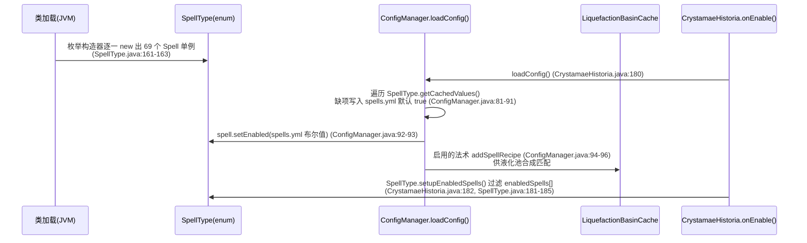
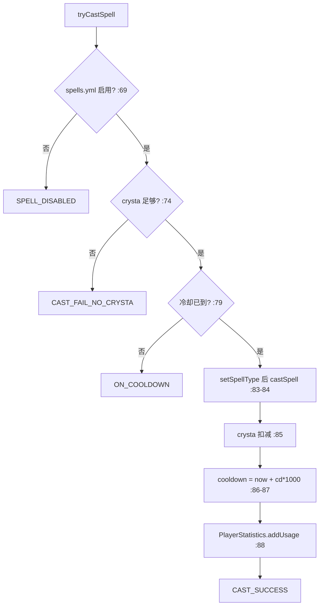
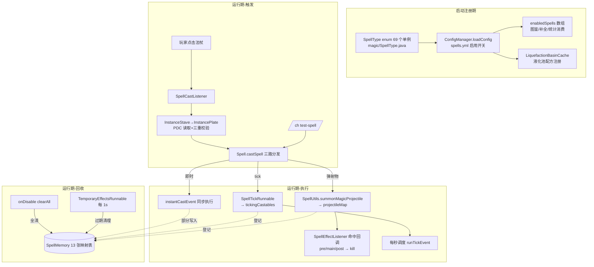

# CrystamaeHistoria 法术系统结构化分析

> 分析日期：2026-08-15
> 分析范围：`src/main/java/io/github/sefiraat/crystamaehistoria/` 下的 `magic/`、`listeners/`、`runnables/` 包与 `SpellMemory.java`
> 分析方法：静态代码阅读（未运行项目）；所有论断均附文件路径与行号。
> 项目背景：Paper 1.21.11 + Slimefun 5.0.0 附属插件（主类 `CrystamaeHistoria extends JavaPlugin implements SlimefunAddon`，`CrystamaeHistoria.java:47`）。

---

## 1. 法术系统核心抽象（magic/ 包）

法术系统采用「枚举注册表 + 抽象基类 + Builder 声明式配置 + 运行时上下文对象」四件套：

| 抽象 | 文件 | 角色 |
|------|------|------|
| `SpellType`（enum） | `magic/SpellType.java:80` | **法术注册表**：每个枚举常量持有一个 `Spell` 单例（`SpellType.java:83-151`，共 69 项），类加载时由枚举构造器即时实例化 |
| `Spell`（abstract class） | `magic/spells/core/Spell.java:38` | **法术基类**：持有 `SpellCore` 与 `enabled` 字段；定义抽象方法 `getRecipe()`/`getLore()`/`getId()`/`getMaterial()`（`Spell.java:48,73,76,84`）；核心入口 `castSpell(CastInformation)`（`Spell.java:87`） |
| `SpellCore` | `magic/spells/core/SpellCore.java:13` | **不可变配置数据**：约 40 个 final 字段（数值参数 + 法杖缩放布尔标志 + 8 个 `Consumer<CastInformation>` 事件槽），`SpellCore.java:15-54` |
| `SpellCoreBuilder` | `magic/spells/core/SpellCoreBuilder.java:16` | **流式构建器**：每个法术在构造器中用它声明自己是哪种类型（instant/projectile/ticking/damaging/healing/effecting）并挂接事件回调 |
| `CastInformation` | `magic/CastInformation.java:16` | **单次施法的可变运行时上下文**：施法者 UUID、法杖等级、施法位置、命中信息、当前 tick 数、6 个事件 Consumer 槽位 |
| `CastResult`（enum） | `magic/CastResult.java:5` | **施法结果枚举**：`CAST_SUCCESS`/`CAST_FAIL_NO_CRYSTA`/`CAST_FAIL_SLOT_EMPTY`/`ON_COOLDOWN`/`SPELL_DISABLED`（`CastResult.java:6-10`，附中文提示文案） |
| `InstanceStave` | `magic/spells/core/InstanceStave.java:23` | **法杖物品运行时包装**：从物品 PDC（`Keys.PDC_STAVE_STORAGE` + `PersistentStaveDataType`）读出 `Map<SpellSlot, InstancePlate>`（`InstanceStave.java:31-41`） |
| `InstancePlate` | `magic/spells/core/InstancePlate.java:22` | **法术板实例**：`tier`/`storedSpell`/`crysta`（充能）/`cooldown`（到期时间戳）；`tryCastSpell()` 是施法前置校验的唯一入口（`InstancePlate.java:64-90`） |
| `SpellSlot`（enum） | `slimefun/items/tools/stave/SpellSlot.java:10` | **4 个法术栏位**：LEFT_CLICK / RIGHT_CLICK / SHIFT_LEFT_CLICK / SHIFT_RIGHT_CLICK（`SpellSlot.java:11-14`） |
| `MagicProjectile` / `MagicFallingBlock` / `MagicSummon` | `magic/spells/spellobjects/*.java` | **法术产物句柄**：分别包装弹射物/下落方块/召唤物的 UUID，提供 `setVelocity`/`kill`/`run` 等方法，注册进 `SpellMemory` 的映射表 |
| `DisplayItem` | `magic/DisplayItem.java:16` | **悬浮展示物品包装**：`registerRemoval(duration)` 注册到 `SpellMemory.displayItems`（`DisplayItem.java:27-29`） |

### 1.1 SpellCoreBuilder 的类型开关（决定一个法术"是什么"）

`SpellCoreBuilder` 构造器只收 6 个基础参数：冷却秒数、冷却是否按法杖等级分摊、射程、射程是否乘算、crysta 消耗、消耗是否乘算（`SpellCoreBuilder.java:67-74`）。之后通过链式方法叠加能力：

| 方法 | 位置 | 作用 |
|------|------|------|
| `makeInstantSpell(Consumer)` | `SpellCoreBuilder.java:108` | 声明即时法术，挂接施法回调 |
| `makeProjectileSpell(Consumer, aoe, aoeMul, kb, kbMul)` | `SpellCoreBuilder.java:117` | 声明弹射物法术，挂接"发射"回调 |
| `makeProjectileVsEntitySpell(Consumer)` | `SpellCoreBuilder.java:136` | 挂接"命中实体"回调 |
| `makeProjectileVsBlockSpell(Consumer)` | `SpellCoreBuilder.java:147` | 挂接"命中方块"回调 |
| `addBeforeProjectileHitEntityEvent` / `addAfterProjectileHitEntityEvent` | `SpellCoreBuilder.java:158,166` | 命中前/后附加回调 |
| `makeTickingSpell(Consumer, ticks, ticksMul, interval, intervalMul)` | `SpellCoreBuilder.java:182` | 声明 tick 持续法术 |
| `addAfterTicksEvent(Consumer)` | `SpellCoreBuilder.java:195` | 全部 tick 结束后的收尾回调 |
| `makeDamagingSpell` / `makeHealingSpell` / `makeEffectingSpell` | `SpellCoreBuilder.java:96,78,87` | 声明伤害/治疗/药水效果属性 |
| `addPositiveEffect` / `addNegativeEffect` | `SpellCoreBuilder.java:213,225` | 注册药水效果；**注意秒→tick 换算 `durationInSeconds * 20` 在此完成**（`SpellCoreBuilder.java:214,226`） |
| `build()` | `SpellCoreBuilder.java:232` | 生成不可变 `SpellCore` |

### 1.2 CastInformation：一次施法携带的全部状态

构造时固定 4 项：施法者 UUID、法杖等级、施法位置克隆、**施法瞬间对 50 格内目标方块的 raycast 结果**（`CastInformation.java:62-68`，`getTargetBlockExact(50)`/`getTargetBlockFace(50)`）。
之后各阶段写入：`spellType`、`damageLocation`、`mainTarget`、`hitBlock`、`projectileLocation`、`currentTick`（每次 `runTickEvent()` 自增，`CastInformation.java:98-103`）。
6 个事件槽位由 `Spell.castSpell()` 或 `registerTicker()` 注入：`beforeProjectileHitEvent`、`projectileHitEvent`、`afterProjectileHitEvent`、`projectileHitBlockEvent`、`tickEvent`、`afterTicksEvent`（`CastInformation.java:49-59`），对应 6 个 `run*Event()` 执行方法（`CastInformation.java:74-109`），全部做了 null 防御。

---

## 2. 注册 / 触发 / 执行机制

### 2.1 注册机制（启动期）



- 注册表是**静态 eager 单例**：`SpellType` 枚举在首次被引用时完成全部 69 个法术实例化，运行期无法增删（`SpellType.java:80-151`）。
- 启用开关持久化在 `spells.yml`（键=法术 ID，值=布尔；`ConfigManager.java:35` 加载、`ConfigManager.java:75-77` 提供 `spellEnabled(Spell)` 查询）。
- `enabledSpells[]` 的消费方：法术图鉴 GUI（`slimefun/itemgroups/SpellCollectionFlexGroup.java:100`）、`/ch test-spell` 与 `/ch test-wand` 的 Tab 补全（`commands/TestSpell.java:43`、`commands/TestWand.java:67`）、玩家统计进度（`player/PlayerStatistics.java:207,229`）。
- 运行期注册：法术产物（弹射物/下落方块/召唤物/闪电/ticker）在施法时登记进 `SpellMemory` 各映射表（见 §4），由监听器与定时器后续消费。

### 2.2 触发机制（玩家如何放出法术）

**主路径：手持法杖交互**（`listeners/SpellCastListener.java:25-57`，监听 `PlayerInteractEvent`）：

```
PlayerInteractEvent
└─ 主手物品是 Slimefun 的 Stave？ (SpellCastListener.java:28-29)
   ├─ 否 → 忽略
   └─ 是 → new InstanceStave(stack)                       (:31)
        └─ SpellSlot.getByPlayerAndAction(player, action) (:32, SpellSlot.java:41-48)
           · 左/右键 × 是否潜行 → 4 选 1 栏位；其他动作返回 null 直接退出
        └─ new CastInformation(player, stave.getLevel())  (:36)
        └─ staveInstance.tryCastSpell(slot, castInfo)     (:37)
           ├─ CAST_SUCCESS → plate 数据写回物品 PDC + 重刷 lore + actionbar (:38-50)
           └─ 其他结果 → actionbar 提示失败原因 (:51-55)
```

- 法杖等级 `staveLevel` 来自 `Stave` 物品注册：基础=1、进阶=2、奥术=3（`slimefun/Tools.java:136-172`），是全局数值缩放的乘数源。
- 法术与栏位的绑定发生在合成/充能环节（液化池产物 `ChargedPlate.getChargedPlate(tier, spellType, crysta)`，`slimefun/items/tools/plates/ChargedPlate.java:29-32`），再装入法杖 PDC。
- **测试旁路**：`/ch test-spell <ID> <power≤5>` 直接 `SpellType.getById(id).castSpell(new CastInformation(player, power))`，绕过 crysta/冷却/禁用检查（`commands/TestSpell.java:27-35`）。

**前置校验链**（`InstancePlate.tryCastSpell`，`InstancePlate.java:64-90`）：



（栏位为空时在 `InstanceStave.tryCastSpell` 提前返回 `CAST_FAIL_SLOT_EMPTY`，`InstanceStave.java:78-85`。）

### 2.3 执行机制（castSpell 的三路分发）

`Spell.castSpell(CastInformation)`（`Spell.java:87-108`）按 `SpellCore` 标志位**顺序触发三类行为，可叠加**（一个法术可同时是弹射物+tick 型）：

1. **即时**（`isInstantCast`）：直接 `instantCastEvent.accept(castInformation)`（`Spell.java:89-91`）。
2. **弹射物**（`isProjectileSpell`）：执行 `fireProjectileEvent`（`Spell.java:93-94`）；若声明命中实体/方块能力，把对应 Consumer 注入 `CastInformation` 留待命中事件触发（`Spell.java:95-102`）。
3. **tick 持续**（`isTickingSpell`）：`registerTicker(...)`（`Spell.java:105-107,119-128`）：
   - 按标志位用法杖等级乘算 tick 次数与间隔（`Spell.java:120-121`）；
   - 注入 `tickEvent`/`afterTicksEvent`（`Spell.java:122-123`）；
   - `new SpellTickRunnable(castInformation, tickAmount)` → 登记进 `SpellMemory.tickingCastables` → `runTaskTimer(plugin, 0, period)`（`Spell.java:125-127`）。

**数值缩放规则**：所有 get 系方法以 `staveLevel` 为乘/除数，是否缩放由 `SpellCore` 布尔标志决定 —— `getCooldownSeconds`（可分摊，`Spell.java:131-133`）、`getRange`/`getCrystaCost`/`getDamage`/`getHealAmount`/`getKnockback`/`getProjectileKnockback`/`getProjectileAoe`（乘算，`Spell.java:136-168`）、药水效果等级与时长（`Spell.java:219-249`）。

**产物登记与命中回收**：
- 发射：法术回调调用 `SpellUtils.summonMagicProjectile(...)`（`utils/SpellUtils.java:108-171`），内部 spawn 实体、设 shooter、禁反弹、火球去燃烧去爆炸，最后 `projectileMap.put(wrapper, Pair(castInfo, 到期时间戳))`（`SpellUtils.java:127-150`；默认存活 5s，带 tickConsumer 的重载默认 30s）。召唤物进 `summonedEntities`（`SpellUtils.java:54-82`），下落方块进 `fallingBlockMap`（`SpellUtils.java:193-204`）。
- 命中：`SpellEffectListener.onProjectileHit`（`SpellEffectListener.java:42-86`，`ProjectileHitEvent` HIGH 优先级）在 projectileMap 反查 `MagicProjectile` → 取消原版行为 → 排除命中自己的乘客（`:60-67`）→ 权限校验 `entityHitAllowed`（`:113-124`）→ 依次 `runPreAffectEvent → runAffectEvent → runPostAffectEvent`（`:74-76`）或方块命中 `runProjectileHitBlockEvent`（`:79-83`）→ `magicProjectile.kill()` 从映射表移除并销毁实体（`MagicProjectile.java:79-85`）。
- 下落方块落地：`onFallingBlockLands`（`EntityChangeBlockEvent`，`SpellEffectListener.java:89-111`）同模式处理。
- 闪电：`Spell.registerLightningStrike`（`Spell.java:205-211`）把闪电 UUID+CastInformation 存入 `strikeMap`（1s 过期）；`LightningStrikeEvent` 触发 `onLightningStrikeHit`（`SpellEffectListener.java:127-143`）执行三段命中回调后从表中移除。

---

## 3. 法术数量与层级划分

### 3.1 数量统计（本仓库实际状态）

| 口径 | 数量 | 证据 |
|------|------|------|
| `magic/spells/tier1/` 下 `Spell` 子类文件 | **70** | Glob 全量统计 |
| `SpellType` 枚举注册项 | **69** | `SpellType.java:83-151`（正则计数核对为 69） |
| 孤儿类（有类未注册） | **1**：`TunnelBore` | `TunnelBore.java:21-24` 注释自述「因问题移除，将以 raycast 版本替代，等待 tier 2 法术」；`SpellType` 无对应枚举项 |

### 3.2 层级（tier）现状

- **本仓库 `magic/spells/` 下只有 `tier1` 一个层级包**（另有 `core/` 与 `spellobjects/`），不存在 tier2/tier3 包；`TunnelBore` 注释提到等待 tier 2 法术，说明更高层级在本版本仅为规划，未落地。
- 代码中 tier 一词有三处实际含义，均不是法术层级包：
  1. `InstancePlate.tier` —— 法术板等级，随 PDC 持久化（`InstancePlate.java:24`、`utils/datatypes/PersistentPlateDataType.java:43,55`）；
  2. `RecipeSpell.tier` —— 液化池配方等级，**全部 69 个法术配方均为 `new RecipeSpell(1, ...)`**（逐一核对 tier1 包 `getRecipe()`；匹配逻辑 `RecipeSpell.java:22-24`、`LiquefactionBasinCache.java:364`）；
  3. `Stave.level` —— 法杖等级 1/2/3（`slimefun/Tools.java:136-172`），即施法缩放乘数 `staveLevel`。
- 结论：**当前版本 69 个法术事实上属于同一层级（tier 1）**；强度差异来自法杖等级的数值缩放与合成配方的故事类型组合。

### 3.3 按执行原型（archetype）划分 69 个已注册法术

依据各法术构造器对 `SpellCoreBuilder.make*` 的 Grep 计数（`makeInstantSpell` 32 文件含 TunnelBore、`makeProjectileSpell` 19 文件、`makeTickingSpell` 23 文件；4 个法术同时调用 projectile+ticking）：

| 原型 | 数量 | 法术 |
|------|------|------|
| 纯即时 | 31 | AbstractVoid, AirSprite, AncientDefence, BatteringRam, Break, Bright, CurificationRitual, Deity, EasterEgg, EndermansVeil, EscapeRope, FlameSprite, GrowUp, Heal, HealingMist, HolyCow, Launch, LavaLake, LovePotion, Oviparous, PhantomsFlight, PhilosophersStone, Prism, Ravage, RemnantOfWar, Shroud, SpawnFiends, Squall, SummonGolem, Teleport, WitherWeather |
| 纯弹射物 | 15 | AirNova, Animaniacs, AntiPrism, Bobulate, CallLightning, Cascada, EarthNova, FanOfArrows, Fireball, FireNova, FrostNova, LeechBomb, PlutosDecent, PoisonNova, Tempest |
| 纯 tick | 19 | BloodMagics, ChillWind, Compass, EtherealFlow, Gravity, Gyroscopic, HarmonysSonata, HarvestMoon, Hearthstone, ImbueVoid, KnowledgeShare, Protectorate, Push, Quake, StripMine, TimeCompression, TimeDilation, Tracer, Vacuum |
| 弹射物+tick 混合 | 4 | Chaos, Hellscape, RainOfFire, StarFall |

合计 31+15+19+4 = **69** ✓

辅助能力维度（可与上述原型叠加）：伤害型 `makeDamagingSpell`、治疗型 `makeHealingSpell`、药水效果型 `makeEffectingSpell` + `addPositiveEffect/addNegativeEffect`（典型样例：`TimeCompression.java:22-30` 挂 4 种正面效果）。

---

## 4. SpellMemory.java：法术效果的中央状态仓库

`SpellMemory`（`src/main/java/io/github/sefiraat/crystamaehistoria/SpellMemory.java:25`）由主类在 `onEnable` 创建（`CrystamaeHistoria.java:177`），经静态门面 `CrystamaeHistoria.getSpellMemory()`（`CrystamaeHistoria.java:84-86`）全局访问。它持有 **13 个内存映射表**，是所有"法术留下的临时世界状态"的唯一登记处：

| 映射表（字段位置） | 类型 | 内容 | 写入方 | 消费方 |
|------|------|------|--------|--------|
| `projectileMap` (:28) | `Map<MagicProjectile, Pair<CastInformation, Long>>` | 法术弹射物 → (施法上下文, 到期毫秒) | `SpellUtils.summonMagicProjectile` (:148) | `SpellEffectListener.onProjectileHit` 反查；`removeProjectiles` 过期清理 |
| `fallingBlockMap` (:30) | `Map<MagicFallingBlock, Pair<CastInformation, Long>>` | 法术下落方块 | `SpellUtils.summonMagicFallingBlock` (:202) | `onFallingBlockLands`；`removeFallingBlocks` |
| `strikeMap` (:32) | `Map<UUID, Pair<CastInformation, Long>>` | 法术闪电（UUID→上下文，1s 过期） | `Spell.registerLightningStrike` (:210) | `onLightningStrikeHit` |
| `tickingCastables` (:34) | `Map<SpellTickRunnable, Integer>` | 进行中的 tick 法术 → 剩余次数 | `Spell.registerTicker` (:126) | `SpellTickRunnable.cancel` 自移除；`clearAll` 统一取消 |
| `blocksToRemove` (:36) | `Map<BlockPosition, Long>` | 法术放置的临时方块 → 到期清除 | `GeneralUtils.java:120` | `removeBlocks` 置 AIR；`BlockRemovalListener` 提前破坏时 `stopBlockRemoval` (:240-243) |
| `summonedEntities` (:38) | `Map<MagicSummon, Long>` | 法术召唤物 → 到期毫秒 | `SpellUtils.summonTemporaryMob` (:70) | `removeEntities`（过期 kill，未过期执行 `run()` tick 回调，:127-137） |
| `playersWithFlight` (:40) | `Map<UUID, Long>` | 获得飞行的玩家 → 到期 | `Gravity` 法术（`tier1/Gravity.java:40`） | `removeFlight` 收回飞行；玩家退出时 `removeFlight(Player)` (:232-238) |
| `playersWithFrozenTime` (:42) | `Map<UUID, Long>` | 个人时间冻结的玩家 | `ExaltedTime` 物品（`slimefun/items/exhalted/ExaltedTime.java:24`） | `removeFrozenTime` 调 `resetPlayerTime` |
| `playersWithFrozenWeather` (:44) | `Map<UUID, Long>` | 个人天气冻结的玩家 | `ExaltedWeather`（`ExaltedWeather.java:25`） | `removeFrozenWeather` 调 `resetPlayerWeather` |
| `inhibitedEndermen` (:46) | `Map<UUID, Long>` | 被禁止传送的末影人 | `EnderInhibitor` 装置（`slimefun/items/gadgets/EnderInhibitor.java:69`） | `EndermanInhibitorListener` 据此拦截传送；`removeEnderman` 过期释放 |
| `noSpawningAreas` (:48) | `Map<BoundingBox, Long>` | 禁止刷怪的区域包围盒 | `MobCandle` 装置（`slimefun/items/gadgets/MobCandle.java:70`） | `MobCandleListener` 据此取消自然刷怪；`enableSpawningInArea` 过期解除 |
| `displayItems` (:50) | `Map<DisplayItem, Long>` | 悬浮展示物品 → 到期 | `DisplayItem.registerRemoval` (:28) | `removeDisplayItems` 调 `kill()` |
| `sleepingBags` (:52) | `Map<UUID, Location>` | 睡袋法术放置的临时床 | `SleepingBag` 工具（`slimefun/items/tools/SleepingBag.java:46`） | `MiscListener.leaveSleepingBag` 离床时移除；`removeSleepingBags` 全部置 AIR |

**清理机制（两条路径）**：
1. **周期性过期回收**：`TemporaryEffectsRunnable` 每 20 tick 调用各 `remove*(false)`，按 `System.currentTimeMillis() > 到期时间` 判定过期（各 remove 方法均先复制 keySet 再遍历，避免并发修改，如 `SpellMemory.java:107-115`）。
2. **插件关闭全清**：`onDisable → spellMemory.clearAll()`（`CrystamaeHistoria.java:208`、`SpellMemory.java:54-105`），按固定顺序：取消全部 ticker → 清弹射物 → 清下落方块 → 清召唤物 → 清临时方块 → 收回飞行 → 复位个人时间 → 复位个人天气 → 解禁末影人 → 解禁刷怪区 → 清展示物品 → 清睡袋。

**值得注意的实现细节**：
- `removeEntities(false)` 在遍历 `summonedEntities` 时，对未过期的召唤物顺带调用 `magicSummon.run()`（`SpellMemory.java:134`）——**召唤物的 tickConsumer 实际由 1s 周期的 TemporaryEffectsRunnable 驱动**。
- `sleepingBags` 无过期时间，只靠离床事件或 clearAll 清理。
- `stopBlockRemoval(Block)`（:240-243）供 `BlockRemovalListener` 在玩家提前破坏临时方块时撤销计划清除，避免重复操作。

---

## 5. listeners/ 包：17 个监听器职责清单

全部监听器在 `ListenerManager` 构造器中按固定顺序注册（`managers/ListenerManager.java:25-43`，经 `registerEvents`，`:45-47`）。按职责分为四类：

### 5.1 法术系统直接相关（3 个）

| 监听器 | 事件（优先级） | 职责 |
|--------|---------------|------|
| `SpellCastListener` (:22) | `PlayerInteractEvent`（默认） | **法术触发入口**：法杖交互 → 栏位解析 → `tryCastSpell` → 成功则回写 PDC/刷 lore/actionbar 提示，失败则提示原因（见 §2.2） |
| `SpellEffectListener` (:39) | `ProjectileHitEvent`、`EntityChangeBlockEvent`、`LightningStrikeEvent`、`EntityDamageEvent`、`EntityDeathEvent`×2、`PlayerQuitEvent`（多数 HIGH） | **法术命中与残留效果守卫**：①弹射物命中三段回调并回收（:42-86）；②下落方块落地回调（:89-111）；③闪电回调（:127-143）；④PDC 无敌标记实体免伤（`PDC_IS_INVULNERABLE`，:146-164，CUSTOM/SUICIDE 除外）；⑤WitherWeather 凋灵骷髅保底掉头颅（`PDC_IS_WEATHER_WITHER`，:167-180）；⑥法术召唤物死亡时取消掉落直接移除（`PDC_IS_SPAWN_OWNER`，:183-189）并禁止其破坏方块（:192-197）；⑦玩家退出收回法术飞行（:210-212） |
| `EndermanInhibitorListener` (:10) | `EntityTeleportEvent` | 末影人在 `SpellMemory.inhibitedEndermen` 登记期内禁止传送（:13-19） |

### 5.2 法术临时世界状态的交互守卫（2 个）

| 监听器 | 事件 | 职责 |
|--------|------|------|
| `BlockRemovalListener` (:14) | `BlockBreakEvent`、`PlayerBucketFillEvent`、`BlockFormEvent`、`BlockExplodeEvent` | 法术临时方块（`GeneralUtils.isRemovableBlock`，metadata 键 `ch`）被破坏/桶装/覆盖/炸毁时：清 metadata、置 AIR、从 `blocksToRemove` 撤销计划清除，并取消原事件（:44-52） |
| `MobCandleListener` (:11) | `CreatureSpawnEvent` | 自然生成的怪物若落在 `noSpawningAreas` 任一包围盒内则取消生成；刷怪笼/刷怪蛋/凋灵搭建除外（:14-27） |

### 5.3 Slimefun 物品/机械交互（9 个）

| 监听器 | 事件（优先级） | 职责 |
|--------|---------------|------|
| `ArmorStandInteract` (:10) | `PlayerArmorStandManipulateEvent`、`BlockDispenseArmorEvent` | 保护展示用盔甲架（PDC 标记）不被玩家操作或发射器穿戴（:13-24） |
| `CrystalBreakListener` (:20) | `BlockBreakEvent`、`BlockPistonExtendEvent` | 打破/活塞推动 `LARGE_AMETHYST_BUD` 故事水晶时，从 `RealisationAltarCache` 取出水晶状态并按稀有度掉落碎片（镀金且手动破坏时掉镀金碎片），:22-66 |
| `CrystaDowngradeListener` (:18) | `EntityCombustByBlockEvent` | 水晶物品实体着火时降级一阶（稀有度 id>1 且 id≠6），取消燃烧并弹跳（:21-46） |
| `DisplayItemListener` (:10) | `InventoryPickupItemEvent`、`ItemDespawnEvent` | 带 `PDC_IS_DISPLAY_ITEM` 标记的展示物品禁止被容器拾取、禁止消失（重置 ticksLived）（:13-25） |
| `MaintenanceListener` (:9) | `CauldronLevelChangeEvent` | 阻止炼药锅（作为液化池机械载体）水位变化（:12-16） |
| `NetherDrainingListener` (:16) | `EntityPortalEnterEvent`（LOWEST） | 物品实体进入下界传送门时按 `CrystaRecipeTypes.getDrainingRecipes()` 转换为产物（下界脱水配方）（:19-38） |
| `RefractingLensListener` (:34) | `PlayerInteractEvent`（LOW） | 折射透镜右键液化池/经验收集器/棱镜镀金器：生成 3 秒悬浮 `DisplayItem` 全息显示内容物数量（:36-127） |
| `SatchelListener` (:19) | `EntityPickupItemEvent`（LOWEST） | 拾取水晶时优先自动吸入玩家背包中的水晶收纳袋（堆叠的收纳袋需先分开）（:22-63） |
| `ThaumaturgicSaltsListener` (:18) | `PlayerInteractEvent` | 奇术盐右键液化池：权限校验后清空池内溶液并消耗 1 个盐（:21-45） |

### 5.4 综合/工具类（3 个）

| 监听器 | 事件 | 职责 |
|--------|------|------|
| `MiscListener` (:29) | `BlockPlaceEvent`×2、`BlockPlacerPlaceEvent`、`EntityShootBowEvent`、`CraftItemEvent`、`AutoDisenchantEvent`、`PlayerInteractEvent`（LOWEST）×2、`PlayerBedLeaveEvent`（LOWEST） | ①带故事的方块禁止放置/放置器放置/参与合成/自动附魔拆解（:32-82）；②画笔不能被弓射出（:50-59）；③遮蔽物（BlockVeil）禁止直接放置（:85-90）；④物品冷却期内的右键交互拦截（`GeneralUtils.isOnCooldown`，:92-102）；⑤离开睡袋时清除法术放置的临时床（:104-112）；⑥发光勺右键调节光照等级（:114-125） |
| `PoseChangerListener` (:34) | `PlayerInteractEvent`（LOW）、`PlayerInteractAtEntityEvent`（LOW）×2 | 姿态调节器：左键切换模式（11 种 PoseType × 4 种 ChangeType，步进 0.01 弧度，:37,265-309），右键盔甲架调整部位姿态（含可见性/尺寸/重力开关，仅注入盔甲架可用）；姿态克隆器：右键保存/潜行应用整套姿态（PDC 存储）（:43-126） |
| `PhilosophersSprayListener` (:11) | `BlockFailedDispenseEvent`（Paper 事件） | 发射器触发失败时驱动贤者之喷装置的状态转换（:14-20） |

---

## 6. runnables/ 包：定时任务职责清单

### 6.1 全局常驻任务（RunnableManager 构造时注册，`managers/RunnableManager.java:18-29`）

| 任务 | 周期（delay, period） | 职责 |
|------|----------------------|------|
| `TemporaryEffectsRunnable` (:7) | (1, 20) 即每秒 1 次 | **SpellMemory 的 GC 驱动者**：依次调用 `removeProjectiles/removeFallingBlocks/removeEntities/removeBlocks/removeFlight/removeFrozenTime/removeFrozenWeather/removeEnderman/enableSpawningInArea/removeDisplayItems`（均传 `false` 仅清过期项，`TemporaryEffectsRunnable.java:10-23`）；同时经由 `removeEntities` 驱动召唤物 tickConsumer（见 §4） |
| `SaveConfigRunnable` (:6) | (1, 12000) 即每 10 分钟 | `ConfigManager.saveAll()` 持久化全部配置（含玩家统计、spells.yml 等，`SaveConfigRunnable.java:9-11`） |
| `ParticleDisplayRunnable` (:13) | (1, 80) 即每 4 秒 | 为手持发光勺（LuminescenceScoop）的玩家高亮周围 ±5 格内的 `Material.LIGHT` 隐形光源方块（WAX_ON 粒子，`ParticleDisplayRunnable.java:16-35`） |

> ⚠️ **潜在缺陷**：`ParticleDisplayRunnable.java:21` 对不持发光勺的玩家使用 `return` 而非 `continue`，导致遍历到第一个不符合条件的玩家即终止整个循环，后续玩家不会被处理。

### 6.2 按需创建的任务（runnables/spells/）

| 任务 | 创建方 | 职责 |
|------|--------|------|
| `SpellTickRunnable` (:9) | `Spell.registerTicker`（每次 tick 型施法 1 个） | 持有 `CastInformation` 与剩余次数：每次 `run()` 次数>0 执行 `runTickEvent()`，否则执行 `runAfterTicksEvent()` 并 `cancel()`；`cancel()` 重写为同时从 `tickingCastables` 注销（`SpellTickRunnable.java:21-35`） |
| `FloatingHeadAnimation` (:9) | `ChroniclerPanelCache`（编年史面板机械，`ChroniclerPanelCache.java:85-86`） | 盔甲架展示头颅的上下浮动动画（±0.2 格往返，每 1 tick 一步）——服务于机械而非法术 |
| `TunnelBoreRunnable` (:22) | 仅被孤儿法术 `TunnelBore` 引用 | 沿直线逐 tick 清空 radius 立方体方块（无掉落）；类注释自述「因问题移除，待 tier 2 以 raycast 版替代」（`:18-21`），**当前版本为死代码** |

---

## 7. 法术执行流程调用链（端到端）

### 7.1 通用前半段（触发 → 分发）

```
[Bukkit 事件总线] PlayerInteractEvent
└── SpellCastListener.onInteract(e)                          listeners/SpellCastListener.java:25
    ├── SlimefunItem.getByItem(stack) → instanceof Stave     (:28-29)
    ├── new InstanceStave(stack)                             (:31) → 从 PDC 读取 plate 映射
    │   └── DataTypeMethods.getCustom(meta, PDC_STAVE_STORAGE, ...)  magic/spells/core/InstanceStave.java:33-37
    ├── SpellSlot.getByPlayerAndAction(player, action)       (:32) → slimefun/items/tools/stave/SpellSlot.java:41
    ├── new CastInformation(player, stave.getLevel())        (:36) → raycast 50 格记录目标方块 magic/CastInformation.java:62-68
    └── InstanceStave.tryCastSpell(slot, castInfo)           magic/spells/core/InstanceStave.java:78
        └── InstancePlate.tryCastSpell(castInfo)             magic/spells/core/InstancePlate.java:64
            ├── ConfigManager.spellEnabled(spell)            managers/ConfigManager.java:75
            ├── Spell.getCrystaCost(castInfo)                magic/spells/core/Spell.java:141  [stave 乘算可选]
            ├── spell.castSpell(castInfo)                    ↓ 见 7.2/7.3/7.4
            ├── 扣 crysta / 写 cooldown                       InstancePlate.java:85-87
            └── PlayerStatistics.addUsage(uuid, spellType)   player/PlayerStatistics.java [统计+图鉴进度]
```

### 7.2 即时型调用链（样例：Heal）

```
Spell.castSpell(castInfo)                                    Spell.java:87
└── instantCastEvent.accept(castInfo)                        Spell.java:90
    └── Heal.cast(castInfo)                                  tier1/Heal.java:28
        ├── GeneralUtils.healEntity(caster, getHealAmount)   utils/GeneralUtils.java [heal 乘 stave 可选]
        └── ParticleUtils.displayParticleEffect(HEART)       utils/ParticleUtils.java
（同步执行完毕，无后续状态残留；若写入 SpellMemory 各表则转入 7.5 回收链）
```

### 7.3 弹射物型调用链（样例：Fireball）

```
Spell.castSpell → fireProjectileEvent.accept                 Spell.java:93-94
└── Fireball.fireProjectile(castInfo)                        tier1/Fireball.java:33
    └── SpellUtils.summonMagicProjectile(castInfo, SMALL_FIREBALL, aim)   utils/SpellUtils.java:108
        └── (private) summonMagicProjectile(..., 5000ms, null)            SpellUtils.java:127-150
            ├── world.spawnEntity / setShooter / setBounce(false)         (:134-138)
            ├── Fireball: setIsIncendiary(false)+setYield(0)              (:139-143)
            ├── magicProjectile.setVelocity(dir, 1.5)        tier1/Fireball.java:37 → MagicProjectile.java:47
            └── CrystamaeHistoria.getProjectileMap().put(wrapper, Pair(castInfo, now+5000))  (:148)
[飞行中……命中时由事件总线回调]
ProjectileHitEvent
└── SpellEffectListener.onProjectileHit(e)                   listeners/SpellEffectListener.java:42
    ├── projectileMap 反查 MagicProjectile                    (:44-47)
    ├── CrystamaeHistoria.getProjectileCastInfo(wrapper)     CrystamaeHistoria.java:118 [取回 castInfo]
    ├── e.setCancelled(true) + 乘客排除                       SpellEffectListener.java:57-67
    ├── entityHitAllowed(castInfo, hitEntity)                (:113) [Slimefun Protection + 排除自己]
    ├── castInfo.runPreAffectEvent()  → Fireball.beforeProjectileHit → 目标点燃 (:74, tier1/Fireball.java:54)
    ├── castInfo.runAffectEvent()     → Fireball.projectileHit → getTargets(AOE) + GeneralUtils.damageEntity (:75, tier1/Fireball.java:41)
    ├── castInfo.runPostAffectEvent() （本例未注册，null 跳过） (:76, CastInformation.java:86-90)
    ├── [若命中方块] runProjectileHitBlockEvent()              (:79-83)
    └── magicProjectile.kill()                               MagicProjectile.java:79 [移除映射+销毁实体]
```

### 7.4 tick 持续型调用链（样例：TimeCompression）

```
Spell.castSpell → registerTicker(castInfo, period, ticks)    Spell.java:105-107
└── Spell.registerTicker                                     Spell.java:119
    ├── ticks/period 按标志乘 staveLevel                      (:120-121)
    ├── castInfo.setTickEvent / setAfterTicksEvent           (:122-123)
    ├── new SpellTickRunnable(castInfo, tickAmount)          runnables/spells/SpellTickRunnable.java:15
    ├── SpellMemory.tickingCastables.put(ticker, tickAmount) Spell.java:126
    └── ticker.runTaskTimer(plugin, 0, period)               Spell.java:127
[调度器每 period tick 回调]
SpellTickRunnable.run()                                      SpellTickRunnable.java:21
├── 次数>0 → castInfo.runTickEvent()                         CastInformation.java:98 [currentTick++]
│   └── TimeCompression.cast(castInfo)                       tier1/TimeCompression.java:34
│       ├── 球面粒子渲染（range 随 stave 乘算）               (:35-50)
│       └── getNearbyEntities → applyPositiveEffects         (:52-57) → Spell.java:219 [4 种正面药水效果]
└── 次数<=0 → castInfo.runAfterTicksEvent() + cancel()       SpellTickRunnable.java:23-24
    └── cancel() → tickingCastables.remove(this)             SpellTickRunnable.java:32-35
```

### 7.5 残留状态回收链（与 7.2-7.4 并行）

```
[每 20 tick] RunnableManager 常驻任务
└── TemporaryEffectsRunnable.run()                           runnables/TemporaryEffectsRunnable.java:10
    └── SpellMemory.remove*(false) ×10                       SpellMemory.java:107-222
        ├── 过期弹射物 → magicProjectile.kill()
        ├── 过期下落方块 → magicFallingBlock.kill()
        ├── 召唤物：过期 kill / 未过期 run() 驱动 tickConsumer   SpellMemory.java:127-137
        ├── 过期临时方块 → setType(AIR)
        ├── 过期飞行/时间/天气 → 玩家状态复位
        └── 过期末影人抑制/刷怪禁区/展示物品 → 解除
[插件关闭] CrystamaeHistoria.onDisable → spellMemory.clearAll()   CrystamaeHistoria.java:208, SpellMemory.java:54
```

---

## 8. 架构总览图



## 9. 关键结论速览

1. **单一注册表**：所有法术经 `SpellType` 枚举静态注册，`spells.yml` 仅控制启用/禁用，不支持运行时新增法术。
2. **声明式法术定义**：法术 = 构造器中的 `SpellCoreBuilder` 链式声明 + 若干方法引用；执行逻辑全部以 `Consumer<CastInformation>` 注入，框架按「即时/弹射物/tick」三路分发且可叠加。
3. **69 个法术全部为 tier 1**：无 tier2/tier3 包；层级概念实际体现为法杖等级（1/2/3）对数值的乘除缩放（`SpellCore` 的 12 个缩放标志位）。
4. **SpellMemory 是唯一的法术残留状态仓库**：13 张映射表统一由 `TemporaryEffectsRunnable`（1s 周期）做过期回收、`onDisable.clearAll()` 做全量清理；召唤物的周期行为也挂载在该回收循环上。
5. **监听器 17 个中仅 3 个直接服务法术系统**（SpellCastListener 触发、SpellEffectListener 命中与效果守卫、EndermanInhibitorListener 状态拦截），其余服务于 Slimefun 物品/机械与世界状态守卫。
6. **死代码提示**：`TunnelBore` + `TunnelBoreRunnable` 未注册、仅存留注释；`ParticleDisplayRunnable.java:21` 的 `return`/`continue` 疑似缺陷。
